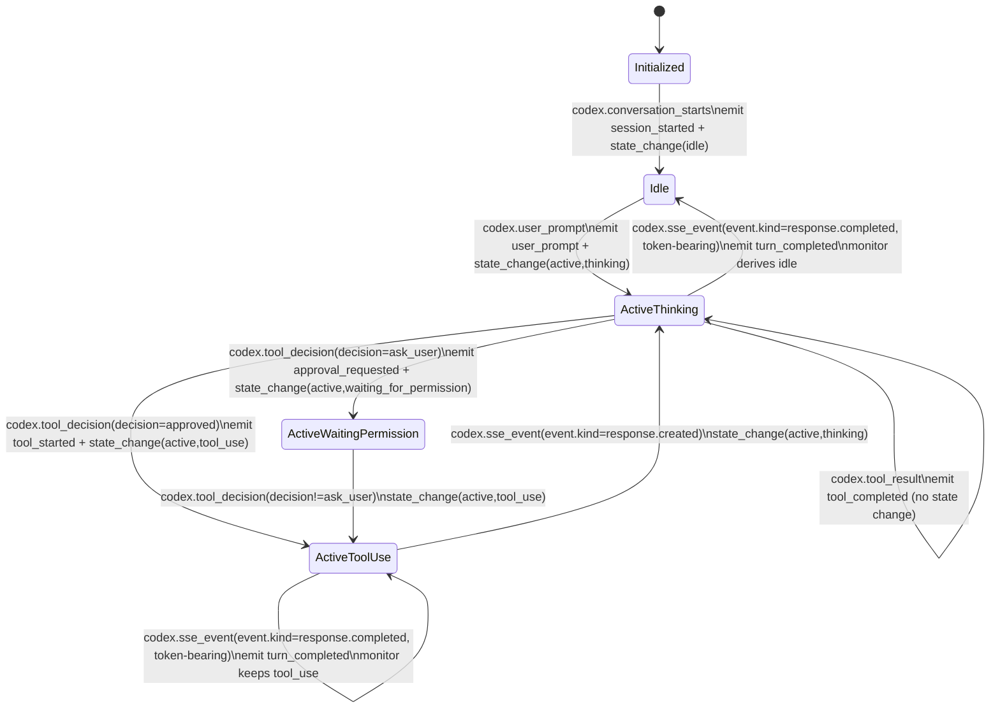
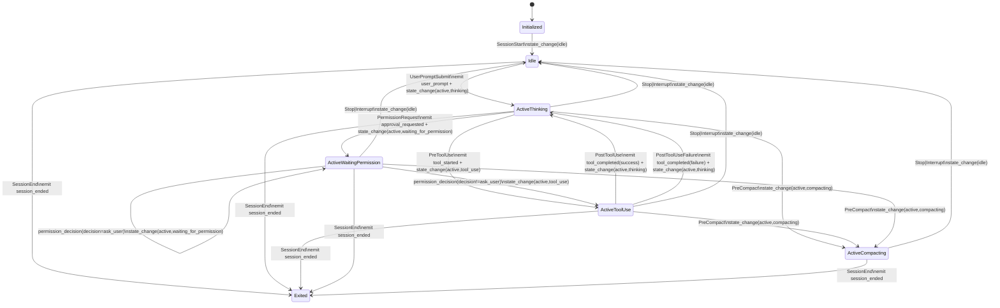

# Agent State Machine

This document defines how `h2` derives agent state from normalized events, and which underlying adapter events produce those transitions.

## Contract

- Each harness-specific event handler is responsible for ingesting raw source streams (OTEL logs/traces/metrics, hooks, session logs), coalescing races, and standardizing them into `AgentEvent`s.
- `AgentMonitor` assumes incoming `AgentEvent`s are already normalized ("pristine") and applies generic aggregation/state updates only.
- Source-specific debounce/race handling belongs in harness event handlers, not in `AgentMonitor`.

## Active Sub-States

`active` has these sub-states:

- `thinking`
- `tool_use`
- `waiting_for_permission`
- `compacting`

## Codex

Source implementation: `internal/session/agent/harness/codex/event_handler.go`.

Underlying OTEL log signals:

- `event.name=codex.conversation_starts`
- `event.name=codex.user_prompt`
- `event.name=codex.tool_decision` (`decision=approved|ask_user|...`)
- `event.name=codex.tool_result`
- `event.name=codex.sse_event` with `event.kind=...` (notably `response.created`, `response.completed`)

Notes:

- `codex.tool_result` is completion-only and never drives idle.
- Codex parser emits normalized events; state derivation is in `AgentMonitor`.
- `response.completed` while in `tool_use` is treated as intermediate completion by the Codex handler (no idle transition).
- `response.created` is used as the authoritative "model resumed response generation" signal.
- Codex handler applies a short idle debounce after token-bearing `response.completed`; `tool_decision approved` within that window cancels the pending idle transition.

## Claude Code

Source implementation: `internal/session/agent/harness/claude/event_handler.go`.

Underlying hook signals:

- `UserPromptSubmit`
- `PreToolUse`
- `PostToolUse`
- `PostToolUseFailure`
- `PermissionRequest`
- `permission_decision` (not a claude code hook, emitted by h2 handle-hook after a permission decision is made)
- `PreCompact`
- `SessionStart`
- `Stop`
- `Interrupt`
- `SessionEnd`

