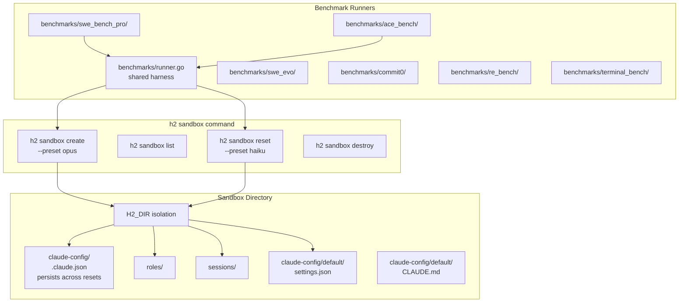
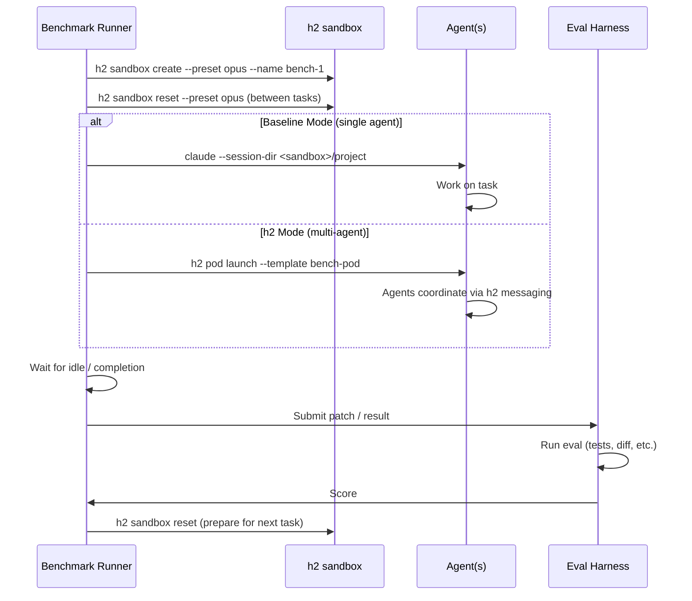

# h2 Benchmark System

## Overview

A system for running standardized coding benchmarks against h2 agent configurations, with isolated sandbox environments that can be created, reset, and reused. The system supports two modes:

1. **Baseline mode** — single Claude Code agent in an empty sandbox (reproduces published benchmark scores)
2. **h2 mode** — multi-agent pods with h2 orchestration (tests whether coordination improves scores)

## Architecture



### Benchmark Run Flow



## `h2 sandbox` Command

### Design

Sandboxes are isolated h2 environments stored at a well-known location (`~/.h2/sandboxes/<name>/`). Each sandbox is a full H2_DIR with its own roles, sessions, sockets, and settings. The key property is that **auth credentials survive resets** while everything else is wiped and rebuilt from a preset.

The sandbox directory is NOT the working directory — the working directory (where the agent does its coding) is separate, typically a temp dir or a clone of a benchmark repo. The sandbox only holds h2 infrastructure (roles, sessions, config).

### Subcommands

#### `h2 sandbox create`

```
h2 sandbox create <name> [--preset <preset>] [--auth-from <config-dir>]
```

Creates a new sandbox directory:
```
~/.h2/sandboxes/<name>/
  .h2-dir.txt
  roles/
  pods/
    roles/
    templates/
  sessions/
  sockets/
  claude-config/default/
    .claude.json          # copied from --auth-from or default config
    settings.json         # generated from preset
    CLAUDE.md             # generated from preset (optional)
  config.yaml
```

- `--preset`: One of `empty`, `hooks`, `haiku`, `opus` (default: `hooks`)
- `--auth-from`: Path to a claude-config dir to copy `.claude.json` from (default: `~/.h2/claude-config/default`)

#### `h2 sandbox list`

```
h2 sandbox list
```

Lists all sandboxes with their status:
```
NAME       PRESET   AUTH    AGENTS   CREATED
bench-1    opus     valid   0        2026-02-17 14:30
bench-2    haiku    valid   2        2026-02-17 14:45
e2e-test   hooks    none    0        2026-02-17 15:00
```

#### `h2 sandbox reset`

```
h2 sandbox reset <name> [--preset <preset>]
```

Wipes all state **except** `claude-config/default/.claude.json`:
- Stops any running agents (sends SIGTERM, waits, SIGKILL)
- Deletes sessions/, sockets/, worktrees/
- Regenerates roles/, settings.json, CLAUDE.md from preset
- Optionally changes preset

#### `h2 sandbox destroy`

```
h2 sandbox destroy <name>
```

Stops agents, removes the entire sandbox directory.

#### `h2 sandbox shell`

```
h2 sandbox shell <name>
```

Opens a shell with `H2_DIR` set to the sandbox. All h2 commands in this shell operate within the sandbox. Useful for manual experimentation.

#### `h2 sandbox exec`

```
h2 sandbox exec <name> -- <command...>
```

Runs a command with `H2_DIR` set to the sandbox. For scripted use:
```bash
h2 sandbox exec bench-1 -- h2 run --role default --name worker --detach
h2 sandbox exec bench-1 -- h2 send worker "solve this issue..."
```

### Presets

Each preset defines a settings.json, optional roles, and optional CLAUDE.md.

#### `empty`
- Minimal settings.json (no hooks, no custom config)
- No roles
- No CLAUDE.md
- Purpose: baseline Claude Code testing — reproduce published scores

#### `hooks`
- Standard h2 hooks (SessionStart, PreToolUse, PostToolUse, UserPromptSubmit, Stop, PermissionRequest, PreCompact)
- No custom roles
- No CLAUDE.md
- Purpose: e2e tests that need state tracking but no agent instructions

#### `haiku`
- h2 hooks
- Default role with `model: haiku`
- Permission mode: `auto-allow` (no permission prompts for benchmarks)
- Purpose: fast, cheap benchmark runs for iteration

#### `opus`
- h2 hooks
- Default role with `model: opus` (or configurable model)
- Permission mode: `auto-allow`
- Concierge role, reviewer role, coder role (standard h2 pod setup)
- CLAUDE.md with standard agent instructions
- Purpose: full h2 multi-agent benchmark runs

### Implementation

New file: `internal/cmd/sandbox.go`

```go
func newSandboxCmd() *cobra.Command {
    cmd := &cobra.Command{
        Use:   "sandbox",
        Short: "Manage isolated h2 environments for benchmarks and testing",
    }
    cmd.AddCommand(
        newSandboxCreateCmd(),
        newSandboxListCmd(),
        newSandboxResetCmd(),
        newSandboxDestroyCmd(),
        newSandboxShellCmd(),
        newSandboxExecCmd(),
    )
    return cmd
}
```

New file: `internal/sandbox/sandbox.go` — core logic (create dirs, apply presets, copy auth, reset, list)

New file: `internal/sandbox/presets.go` — preset definitions (settings.json templates, role YAML templates, CLAUDE.md templates)

## Benchmark Runner Framework

### Directory Structure

```
benchmarks/
  runner/
    runner.go             # shared harness (sandbox management, agent lifecycle, result collection)
    config.go             # benchmark configuration types
    results.go            # result storage and reporting
    baseline.go           # single-agent baseline runner
    pod.go                # multi-agent pod runner
  swe_bench_pro/
    main.go               # benchmark entry point
    setup.go              # download dataset, prepare repos
    eval.go               # run SWE-bench evaluation
    README.md
  swe_evo/
    main.go
    setup.go
    eval.go
  ace_bench/
    main.go
    setup.go
    eval.go
  commit0/
    main.go
    setup.go
    eval.go
  re_bench/
    main.go
    setup.go
    eval.go
  terminal_bench/
    main.go
    setup.go
    eval.go
  swe_bench_verified/     # baseline for credibility
    main.go
    setup.go
    eval.go
  results/                # stored benchmark results (gitignored)
    <benchmark>/<run-id>/
      config.json
      results.json
      logs/
```

### Runner Framework

```go
// BenchmarkConfig describes a benchmark run
type BenchmarkConfig struct {
    Name        string            // e.g. "swe_bench_pro"
    Mode        RunMode           // Baseline or H2
    Preset      string            // sandbox preset
    PodTemplate string            // pod template for H2 mode (empty for baseline)
    TaskFilter  []string          // optional: run only specific task IDs
    Timeout     time.Duration     // per-task timeout
    Concurrency int               // how many tasks to run in parallel (different sandboxes)
}

type RunMode string
const (
    ModeBaseline RunMode = "baseline"  // single claude code agent
    ModeH2       RunMode = "h2"        // multi-agent pod
)

// BenchmarkTask is a single benchmark problem
type BenchmarkTask struct {
    ID          string
    RepoURL     string            // git repo to clone
    BaseCommit  string            // checkout this commit
    Issue       string            // issue description / prompt
    TestPatch   string            // tests to validate solution (SWE-bench style)
    EvalFunc    func(workDir string) (TaskResult, error) // custom eval
}

// TaskResult is the outcome of one task
type TaskResult struct {
    TaskID      string
    Mode        RunMode
    Resolved    bool
    Duration    time.Duration
    TokensUsed  int64
    Cost        float64           // USD
    AgentCount  int
    Logs        string            // path to logs
}
```

### Runner Flow Per Task

```go
func (r *Runner) RunTask(ctx context.Context, task BenchmarkTask) TaskResult {
    // 1. Reset sandbox
    sandbox.Reset(r.sandboxName, r.config.Preset)

    // 2. Prepare working directory
    workDir := cloneRepo(task.RepoURL, task.BaseCommit)

    // 3. Run agent(s)
    switch r.config.Mode {
    case ModeBaseline:
        // Launch single claude code process directly
        // CLAUDE_CONFIG_DIR from sandbox, working dir = workDir
        // Send issue as initial prompt, wait for completion
        runBaseline(ctx, r.sandbox, workDir, task.Issue)

    case ModeH2:
        // Launch pod within sandbox
        // h2 sandbox exec <name> -- h2 pod launch --template <template>
        // Send task to concierge via h2 send
        // Wait for all agents idle
        runH2Pod(ctx, r.sandbox, workDir, task)
    }

    // 4. Collect result
    patch := generatePatch(workDir, task.BaseCommit)

    // 5. Evaluate
    result := task.EvalFunc(workDir)
    // OR: apply test patch + run tests (SWE-bench style)

    // 6. Record
    saveResult(r.resultsDir, result)
    return result
}
```

### Baseline Runner

For baseline mode, we bypass h2 entirely and run Claude Code directly:

```go
func runBaseline(ctx context.Context, sb *Sandbox, workDir string, issue string) {
    cmd := exec.CommandContext(ctx, "claude",
        "--print",           // non-interactive
        "--session-id", uuid.New().String(),
        "--max-turns", "100",
    )
    cmd.Dir = workDir
    cmd.Env = append(os.Environ(),
        "CLAUDE_CONFIG_DIR="+sb.ClaudeConfigDir(),
    )
    cmd.Stdin = strings.NewReader(issue)
    cmd.Run()
}
```

This gives us the published Claude Code baseline to compare against.

### Pod Runner

For h2 mode, we use the sandbox's h2 environment:

```go
func runH2Pod(ctx context.Context, sb *Sandbox, workDir string, task BenchmarkTask) {
    // Launch pod with working directory pointed at the benchmark repo
    sb.Exec("h2", "pod", "launch", "--template", "benchmark",
        "--var", "working_dir="+workDir)

    // Wait for agents to come up
    sb.WaitForAgents(ctx, 30*time.Second)

    // Send task to concierge
    sb.Exec("h2", "send", "concierge", task.Issue)

    // Wait for all agents to go idle (with timeout)
    sb.WaitForAllIdle(ctx, task.Timeout)

    // Stop all agents
    sb.Exec("h2", "pod", "stop", "benchmark")
}
```

### Pod Templates for Benchmarks

```yaml
# ~/.h2/sandboxes/<name>/pods/templates/benchmark.yaml
name: benchmark
agents:
  - name: concierge
    role: concierge
    working_dir: "{{ .Var.working_dir }}"
  - name: coder
    role: coder
    count: 2
    working_dir: "{{ .Var.working_dir }}"
  - name: reviewer
    role: reviewer
    working_dir: "{{ .Var.working_dir }}"
```

Benchmark-specific pod templates can vary the agent count, roles, and instructions to test different configurations.

## Benchmark Implementations

### SWE-bench Pro (Tier 1 — highest priority)

**Dataset**: 731 public instances from [SWE-bench Pro OS](https://github.com/scaleai/SWE-bench_Pro-os)

**Setup**:
1. Clone SWE-bench Pro dataset repo
2. For each task: clone target repo at base commit into Docker container (or local dir)
3. Apply environment setup patch if needed

**Eval**:
- Apply test patch to working dir
- Run specified test commands
- Check fail-to-pass (issue fixed) and pass-to-pass (no regressions)

**Why first**: Low SOTA (23%), multi-file tasks, well-established eval harness we can reuse from SWE-bench.

### ACE-Bench (Tier 1)

**Dataset**: 212 tasks from [ACE-Bench](https://github.com/ace-bench/ace-bench)

**Setup**:
1. Clone ACE-Bench evaluation framework
2. For each task: clone repo at base commit, set up environment

**Eval**: Execution-based — run task-specific test suites

**Why important**: Feature-level development (7.5% SOTA) is the closest benchmark to h2's primary use case.

### SWE-EVO (Tier 1)

**Dataset**: 48 evolution tasks from 7 Python projects

**Setup**: Clone repos at specified versions, provide evolution task descriptions

**Eval**: Run validation test suite (~874 tests per task)

**Why important**: 21-file average per task practically demands decomposition.

### Commit0 (Tier 1)

**Dataset**: 54 Python libraries (16 lite)

**Setup**: Clone starter repos with specs + test suites

**Eval**: Unit test pass rate + coverage + static analysis

**Why important**: Library generation from scratch is the ultimate decomposition task.

### RE-bench (Tier 2)

**Dataset**: 7 environments from [METR](https://github.com/METR/re-bench)

**Setup**: Docker containers with pre-configured environments

**Eval**: Score optimization over time budgets (2h, 8h, 32h)

**Why important**: Long time horizons test distributed memory.

### Terminal-Bench (Tier 2)

**Dataset**: 89 tasks from [Terminal-Bench 2.0](https://github.com/laude-institute/terminal-bench)

**Setup**: Docker containers with pre-configured environments

**Eval**: Task completion verification (file state, output matching)

**Why important**: h2 is a terminal multiplexer — natural fit.

### SWE-bench Verified (Tier 2 — baseline credibility)

**Dataset**: 500 instances (well-established)

**Setup**: Standard SWE-bench harness

**Eval**: Standard fail-to-pass + pass-to-pass

**Why important**: Industry-standard baseline. Needed for credibility even though it won't differentiate h2.

## Results and Reporting

### Result Storage

```
benchmarks/results/<benchmark>/<run-id>/
  config.json         # RunMode, preset, pod template, model, timestamp
  summary.json        # aggregate scores
  tasks/
    <task-id>.json    # per-task result (resolved, duration, cost, tokens)
  logs/
    <task-id>/        # agent logs, activity logs, patches
```

### Comparison Report

```
$ h2 benchmark report swe_bench_pro

SWE-bench Pro Results
=====================
Run ID      Mode       Preset   Resolved   Avg Cost   Avg Time   Agents
--------    --------   ------   --------   --------   --------   ------
run-001     baseline   empty    23/100     $0.45      8m 30s     1
run-002     h2         opus     31/100     $1.20      12m 15s    4
run-003     h2         haiku    28/100     $0.35      15m 00s    4

Published baseline (Claude + Claude Code): 23%
```

### Key Metrics Per Run
- **Resolve rate** (% tasks solved)
- **Cost per task** (USD, from API usage)
- **Time per task** (wall clock)
- **Token efficiency** (tokens per resolved task)
- **Agent utilization** (% time agents active vs idle)
- **Memory events** (compactions per task, context resets)

## Implementation Plan

### Phase 1: Sandbox Command
1. `internal/sandbox/sandbox.go` — core sandbox management
2. `internal/sandbox/presets.go` — preset definitions
3. `internal/cmd/sandbox.go` — CLI command
4. Unit tests for sandbox create/reset/destroy
5. Integration test: create sandbox, run agent, verify isolation

### Phase 2: Runner Framework
1. `benchmarks/runner/` — shared harness
2. Baseline runner (single Claude Code)
3. Pod runner (multi-agent via sandbox exec)
4. Result collection and storage

### Phase 3: First Benchmark (SWE-bench Pro)
1. Dataset download and preparation
2. Task runner with Docker-based eval
3. End-to-end run: baseline + h2 mode on 10-task subset
4. Validate scores match published baselines

### Phase 4: Additional Benchmarks
1. ACE-Bench
2. SWE-EVO
3. Commit0
4. RE-bench, Terminal-Bench, SWE-bench Verified

### Phase 5: Reporting and Analysis
1. Comparison reports
2. Cost-performance Pareto analysis
3. Per-scenario breakdown (which task types benefit most from multi-agent?)

## Shared Infrastructure with E2E Tests

The sandbox system is designed to be reused by the message receipt reliability e2e test suite (see `docs/plan-message-receipt-reliability.md`). The e2e tests would use:

- `h2 sandbox create --preset hooks` for test environments
- `h2 sandbox reset` between test runs
- `h2 sandbox exec` for running h2 commands in isolation
- Permission script injection via preset customization

The sandbox command provides the programmatic equivalent of what the e2e test framework currently does manually with `createTestH2Dir()`.

## Open Questions

1. **Docker vs local**: Some benchmarks (SWE-bench Pro, RE-bench) expect Docker for environment isolation. Should sandboxes manage Docker containers, or should that be benchmark-specific?

2. **Concurrent sandboxes**: For running multiple benchmark tasks in parallel, we need multiple sandboxes. Should we support `h2 sandbox create bench-{1..10}` for batch creation?

3. **Cost limits**: Should the runner framework enforce per-task and per-run cost limits to prevent runaway spending?

4. **Pod template experimentation**: Should we support parameterized pod templates (varying agent count, model, role instructions) for systematic A/B testing?
