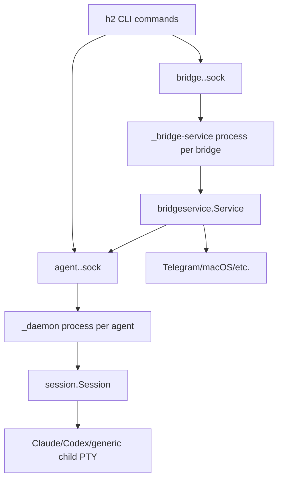
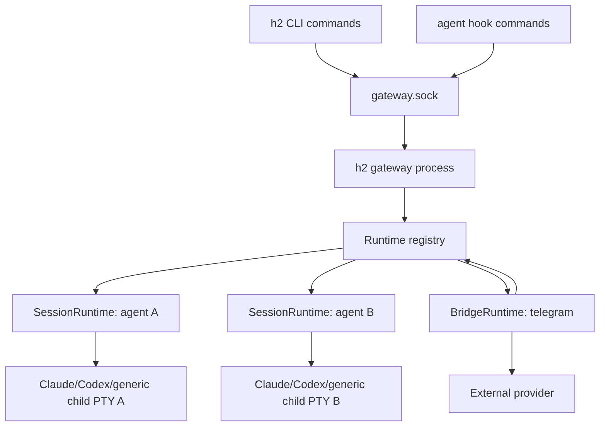
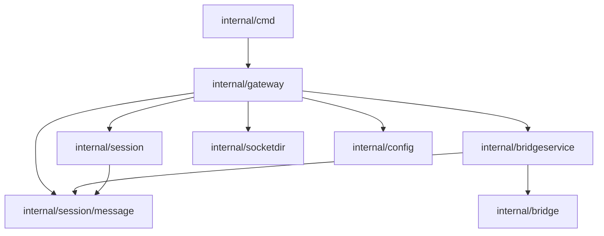

# Gateway Model Plan

## Summary

h2 currently runs one long-lived daemon process per agent session and one long-lived daemon process per bridge service. Each daemon owns its own Unix socket, so CLI commands discover running work by listing `agent.<name>.sock` and `bridge.<name>.sock` files in the h2 socket directory. The gateway model replaces that process topology with one long-running gateway per `H2_DIR`.

The selected design is a single gateway process that owns all agent sessions, all external bridge integrations, all process supervision, and the one public IPC socket for that h2 directory. Agent CLIs such as Claude Code and Codex remain separate child processes running inside PTYs, but they are direct children of the gateway rather than children of per-agent daemon processes. Bridge receivers such as Telegram polling run as goroutines inside the gateway rather than as separate bridge daemons.

The user-facing configuration should not change. Existing role YAML, bridge config, profile config, session metadata, pod launching, attach, send, list, stop, trigger, schedule, rotate, and bridge commands keep their current UX. The implementation replaces the internal runtime transport and process model beneath those commands.

## Shaping

### Requirements

| Req | Requirement | Status |
| --- | --- | --- |
| R0 | One gateway process governs all runtime state for one `H2_DIR`. | Core goal |
| R1 | Agent and bridge config remains unchanged or minimally changed. | Must-have |
| R2 | `h2 run` transparently starts the gateway in the background when needed. | Must-have |
| R3 | The gateway can also run in the foreground under a process supervisor. | Must-have |
| R4 | CLI commands talk to one central communication channel. | Must-have |
| R5 | The gateway is the single process manager for all agent child processes. | Must-have |
| R6 | External bridge integrations are managed centrally and route through the same runtime registry. | Must-have |
| R7 | Existing attach, send, list, stop, trigger, schedule, rotate, bridge, pod, and hook behaviors remain user-transparent. | Must-have |
| R8 | Gateway crash and restart behavior is explicit, testable, and does not corrupt session metadata. | Must-have |
| R9 | Gateway restart automatically brings every previously live agent back up with resume, without requiring per-agent user commands. | Must-have |
| R10 | Agent child environment is deterministic for supervised and remote operation, with explicit passthrough only for approved launch-scoped variables. | Must-have |

### Shapes Considered

| Shape | Mechanism |
| --- | --- |
| A: Gateway supervises legacy per-agent daemons | Add a gateway that launches and monitors the existing `_daemon` and `_bridge-service` processes, then proxy central RPCs to their existing sockets. |
| B: Gateway embeds sessions and bridges | Add a gateway that owns multiple in-process `SessionRuntime` instances and bridge services. Agent CLIs are direct child processes of the gateway. |
| C: Gateway owns only messaging and bridge routing | Keep one daemon per agent for PTY and lifecycle, but move message routing and bridge integrations into the gateway. |

### Fit Check

| Req | Requirement | Status | A | B | C |
| --- | --- | --- | --- | --- | --- |
| R0 | One gateway process governs all runtime state for one `H2_DIR`. | Core goal | No | Yes | No |
| R1 | Agent and bridge config remains unchanged or minimally changed. | Must-have | Yes | Yes | Yes |
| R2 | `h2 run` transparently starts the gateway in the background when needed. | Must-have | Yes | Yes | Yes |
| R3 | The gateway can also run in the foreground under a process supervisor. | Must-have | Yes | Yes | Yes |
| R4 | CLI commands talk to one central communication channel. | Must-have | Yes | Yes | Yes |
| R5 | The gateway is the single process manager for all agent child processes. | Must-have | No | Yes | No |
| R6 | External bridge integrations are managed centrally and route through the same runtime registry. | Must-have | No | Yes | Yes |
| R7 | Existing attach, send, list, stop, trigger, schedule, rotate, bridge, pod, and hook behaviors remain user-transparent. | Must-have | Yes | Yes | Yes |
| R8 | Gateway crash and restart behavior is explicit, testable, and does not corrupt session metadata. | Must-have | No | Yes | No |
| R9 | Gateway restart automatically brings every previously live agent back up with resume, without requiring per-agent user commands. | Must-have | No | Yes | No |
| R10 | Agent child environment is deterministic for supervised and remote operation, with explicit passthrough only for approved launch-scoped variables. | Must-have | No | Yes | No |

Shape B is selected. Shape A is a useful transitional implementation strategy only if needed to reduce risk, but it does not satisfy the core goal because runtime ownership stays distributed. Shape C improves bridge routing but leaves process management split.

## Current Architecture



Key current boundaries:

| Area | Current owner | Files |
| --- | --- | --- |
| Agent daemon startup | `h2 run` writes `session.metadata.json`, then `session.ForkDaemon` re-execs `_daemon`. | `internal/cmd/run.go`, `internal/cmd/agent_setup.go`, `internal/session/daemon.go`, `internal/cmd/daemon.go` |
| Agent socket protocol | Each `_daemon` listens on one Unix socket and handles `send`, `attach`, `status`, `stop`, `relaunch`, hooks, triggers, and schedules. | `internal/session/listener.go`, `internal/session/message/protocol.go` |
| Session runtime | `Session.RunDaemon` owns PTY, VT buffers, client attach, message queue, monitor, automation, and child relaunch. | `internal/session/session.go` |
| Bridge daemon startup | `h2 bridge create` re-execs `_bridge-service`, then optionally starts a concierge agent. | `internal/cmd/bridge.go`, `internal/cmd/bridge_daemon.go`, `internal/bridgeservice/fork.go` |
| Bridge runtime | `bridgeservice.Service` owns provider receivers, provider senders, concierge routing, typing, and bridge socket control. | `internal/bridgeservice/service.go`, `internal/bridge/*` |
| Discovery | CLI commands list and dial socket files. | `internal/socketdir/socketdir.go`, `internal/cmd/list.go`, `internal/cmd/send.go`, `internal/cmd/attach.go`, `internal/cmd/stop.go` |

## Target Architecture



The gateway becomes the only daemon-like runtime process for one `H2_DIR`. It exposes `gateway.sock`, maintains an in-memory registry of sessions and bridge services, starts and stops child agent processes, and provides all user-visible IPC.

Steady-state socket files:

| Socket | Purpose |
| --- | --- |
| `gateway.sock` | The one public runtime socket for CLI, hooks, attach clients, bridge control, and status. |

Per-agent and per-bridge socket files are removed from steady-state runtime. CLI compatibility is preserved at the command layer by changing commands to call gateway RPCs, not by keeping permanent per-agent socket listeners.

## Package Structure

```text
internal/gateway/
  gateway.go          # Gateway lifecycle, foreground/background startup
  manager.go          # session and bridge registry
  listener.go         # gateway.sock accept loop and request dispatch
  protocol.go         # gateway RPC request/response types
  client.go           # CLI-side gateway RPC client and EnsureRunning
  session_runtime.go  # adapter around session.Session
  bridge_runtime.go   # adapter around bridgeservice.Service
  supervisor.go       # child process supervision, shutdown, restart policy
  recovery.go         # startup scan and stale metadata reconciliation
  lock.go             # cross-process startup lock for one gateway per H2_DIR
  state.go            # exported snapshots for list/status
```

Refactors in existing packages:

| Package | Change |
| --- | --- |
| `internal/session` | Split `Daemon` into reusable session runtime pieces. Keep `Session` as the owner of VT, clients, queue, monitor, automation, and child lifecycle. Replace `RunDaemon` with `RunManaged(ctx, opts)` that accepts a listener callback instead of creating a socket. |
| `internal/bridgeservice` | Split provider routing from bridge socket control. Keep `Service` for provider receivers/senders, but inject a `Router` interface instead of dialing agent sockets. Remove bridge socket listener from the service. |
| `internal/socketdir` | Add `TypeGateway` and `GatewayPath`. Keep long-path symlink logic. Stop using `ListByType(TypeAgent)` as the authoritative running-agent registry in normal commands. |
| `internal/cmd` | Replace direct socket discovery with `gateway.Client`. Add `h2 gateway run/start/status/stop`. Keep hidden `_daemon` and `_bridge-service` only until their call sites are fully deleted. |
| `internal/session/message` | Keep queue and attach framing types, but move top-level cross-runtime request types to `internal/gateway/protocol` so agent and bridge control are no longer conflated. |

Import flow:



`internal/session` must not import `internal/gateway`. It receives dependencies through interfaces so the session package can still be unit-tested independently.

## Connected Components

| Component | Gateway boundary | Contract |
| --- | --- | --- |
| CLI commands | `internal/gateway.Client` | `EnsureRunning(opts)`, `Request(ctx, *gateway.Request)`, and `Attach(ctx, name, opts, conn)` replace direct `net.Dial("unix", agent.sock)` and `net.Dial("unix", bridge.sock)` call sites. |
| Session runtime | `SessionRuntime` wrapping `session.Session` | `RunManaged(ctx, ManagedOpts)`, `Attach(ctx, conn, AttachOpts)`, `Send(SendSpec)`, `Status() *message.AgentInfo`, `Stop(ctx)`, `Relaunch(ctx, RelaunchOpts)`. |
| Agent harnesses | Existing `harness.Harness` interface | Gateway does not call harnesses directly except through `session.Session`; `RuntimeConfig` remains the serialized contract for launch arguments and environment. |
| Bridge service | `BridgeRouter` injected into `bridgeservice.Service` | `SendToAgent(ctx, agentName, from, body, opts)`, `FirstAvailableAgent(ctx)`, and `AgentState(ctx, agentName)` replace bridge-side socket dialing. |
| Socket directory | `socketdir.TypeGateway` | `socketdir.Path(socketdir.TypeGateway, "gateway")` is the only steady-state runtime socket path. Legacy agent and bridge socket parsing remains only for startup cleanup during migration. |
| Runtime metadata | `config.RuntimeConfig` | Existing user-facing fields remain valid. Gateway-managed lifecycle fields are internal, optional for backward compatibility, and authoritative for restart intent once present. |
| Automation | Existing trigger and schedule engines per session | Gateway routes trigger and schedule RPCs to the owning `SessionRuntime`; automation execution still enqueues into that session queue. |
| Event and activity logs | Existing session log files | Gateway lifecycle events are added in `<H2_DIR>/logs/gateway-events.jsonl`; per-session `events.jsonl` and activity logs remain unchanged. |

The most important contract is that the gateway owns discovery and process lifetime while `session.Session` still owns per-agent terminal behavior. This keeps the migration from turning `internal/gateway` into a replacement terminal multiplexer.

## Gateway Lifecycle

### Commands

| Command | Behavior |
| --- | --- |
| `h2 gateway run` | Run the gateway in the foreground. Intended for launchd, systemd, tmux, or another process supervisor. Logs to stderr unless `--log-file` is supplied. |
| `h2 gateway start` | Start the gateway in the background if it is not already running. This is the same mechanism used by `h2 run` auto-start. |
| `h2 gateway status` | Dial `gateway.sock`, print gateway PID, uptime, session count, bridge count, and foreground/background mode as JSON by default. |
| `h2 gateway stop` | Ask the gateway to gracefully stop bridges, stop or detach agent children according to policy, remove `gateway.sock`, and exit. |

Foreground `h2 gateway run` installs SIGINT and SIGTERM handlers that call the same graceful `Gateway.Shutdown` path as `gateway_stop`. This is required for launchd/systemd/tmux supervision where SIGTERM is the normal stop signal.

### Auto-start

`h2 run`, `h2 bridge create`, `h2 pod launch`, and any command that requires a live runtime call:

```go
client, err := gateway.EnsureRunning(gateway.EnsureOpts{
    Mode: gateway.AutoStartBackground,
    TerminalHints: detectTerminalHints(),
})
```

`EnsureRunning`:

1. Resolves `H2_DIR`.
2. Acquires `<H2_DIR>/gateway.lock` with an OS file lock for the probe/start/readiness critical section.
3. Probes `gateway.sock`.
4. If live, returns a client.
5. If stale, removes it.
6. If missing, re-execs the h2 binary with hidden `_gateway --background`.
7. Waits for `gateway.sock` readiness with an explicit health check.
8. Releases `gateway.lock`.

The startup lock is required because concurrent first-use commands can all observe a missing socket before any one background gateway finishes listening. The external startup-race test must fail without this lock.

`h2 gateway run` uses the same `Gateway.Run(ctx)` code path but skips forking and keeps stdio attached.

### Shutdown Order

Gateway shutdown is ordered so long-lived attach streams and bridge receivers cannot race new work into sessions that are being stopped:

```mermaid
sequenceDiagram
    participant CLI as h2 gateway stop / SIGTERM
    participant G as Gateway
    participant B as BridgeRuntime
    participant A as AttachRuntime
    participant S as SessionRuntime
    participant C as Child process

    CLI->>G: gateway_stop or signal
    G->>G: close listener; reject new RPCs
    G->>B: stop receivers
    G->>A: cancel attach contexts and close attach conns
    G->>S: stop sessions
    S->>C: graceful PTY stop, then process-group kill on timeout
    G->>G: remove gateway.sock
```

Active attach connections are tracked by the gateway and each `SessionRuntime`. Canceling the attach context causes the attach frame loop to close the connection and remove the client before the child PTY is stopped. This produces a clean terminal disconnect instead of relying on broken pipes during child shutdown.

### Startup Recovery

On startup, the gateway scans:

| Path | Use |
| --- | --- |
| `<H2_DIR>/sessions/*/session.metadata.json` | Discover resumable sessions and recent metadata. |
| `<H2_DIR>/sockets/agent.*.sock` and `bridge.*.sock` | Detect stale legacy socket files and remove only if probing confirms they are dead. |
| `<H2_DIR>/logs/gateway.log` | Append structured lifecycle events. |
| Per-session gateway lifecycle metadata | Distinguish agents the user wants running from agents intentionally stopped before a gateway crash or restart. This replaces agent sockets as the authoritative restart-intent signal. |

The gateway does not automatically resume every historical stopped session. It automatically resumes only sessions whose persisted `GatewayDesiredState` is `running`. Sessions whose `GatewayDesiredState` is `stopped` remain stopped and visible through `h2 list --include-stopped`.

Gateway recovery must not assume child agent processes died with the gateway. Each `SessionRuntime` starts its child in a distinct process group where the platform supports it and records the child PID, process group ID, desired state, observed runtime state, and harness resume ID in runtime metadata. On startup, after acquiring `gateway.lock`, the gateway scans sessions whose desired state is `running`. For each one, it terminates any orphaned previous process group that is still alive, then starts a new `SessionRuntime` with `ResumeSessionID` set from `HarnessSessionID`. This restores every desired-running agent automatically while preventing abandoned Claude/Codex processes from continuing to consume tokens.

Automatic resume ordering:

1. Recover gateway identity and acquire `gateway.lock`.
2. Remove stale gateway socket if no live gateway responds.
3. Scan runtime metadata for `GatewayDesiredState: "running"`.
4. For each candidate, terminate any recorded orphan process group.
5. Start the session with resume semantics and preserve its agent name, role, pod, profile, CWD, and queue/event metadata.
6. If resume succeeds, write `GatewayRuntimeState: "running"` and the new child PID/PGID.
7. If resume fails, keep `GatewayDesiredState: "running"`, write `GatewayRuntimeState: "resume_failed"` plus `LastExitReason: "gateway_resume_failed"`, and include the session in `h2 list` with a visible error state so the next gateway restart or explicit retry can try again.

## Runtime Model

### Gateway

```go
type Gateway struct {
    h2Dir       string
    socketPath  string
    listener    net.Listener
    registry    *Manager
    log          *slog.Logger
    shutdownCh  chan struct{}
}

func (g *Gateway) Run(ctx context.Context) error
func (g *Gateway) ServeConn(ctx context.Context, conn net.Conn)
func (g *Gateway) Shutdown(ctx context.Context, opts ShutdownOpts) error
```

### Manager

```go
type Manager struct {
    sessions map[string]*SessionRuntime
    bridges  map[string]*BridgeRuntime
    mu       sync.RWMutex
}

func (m *Manager) StartSession(ctx context.Context, req StartSessionRequest) (*AgentSnapshot, error)
func (m *Manager) ResumeSession(ctx context.Context, req ResumeSessionRequest) (*AgentSnapshot, error)
func (m *Manager) StopSession(ctx context.Context, name string) error
func (m *Manager) RelaunchSession(ctx context.Context, name string, opts RelaunchOpts) error
func (m *Manager) AttachSession(ctx context.Context, name string, conn net.Conn, opts AttachOpts) error
func (m *Manager) SendToSession(ctx context.Context, req SendRequest) (*SendResponse, error)
func (m *Manager) StartBridge(ctx context.Context, req StartBridgeRequest) (*BridgeSnapshot, error)
func (m *Manager) StopBridge(ctx context.Context, name string) error
func (m *Manager) List(ctx context.Context, opts ListOpts) (*RuntimeSnapshot, error)
```

The manager is the only component allowed to mutate the runtime registry. It enforces unique agent and bridge names before child process launch.

### SessionRuntime

```go
type SessionRuntime struct {
    name       string
    sessionDir string
    rc         *config.RuntimeConfig
    session    *session.Session
    cancel     context.CancelFunc
    done       chan error
}

func (r *SessionRuntime) Start(ctx context.Context, opts session.ManagedOpts) error
func (r *SessionRuntime) Attach(ctx context.Context, conn net.Conn, opts AttachOpts) error
func (r *SessionRuntime) Send(req SendRequest) (*SendResponse, error)
func (r *SessionRuntime) Stop(ctx context.Context) error
func (r *SessionRuntime) Snapshot() AgentSnapshot
```

`SessionRuntime.Start` calls `session.NewFromConfig`, wires automation and monitor callbacks, then starts the child PTY directly. There is no `_daemon` re-exec. `SessionRuntime.Attach` creates a `client.Client` and reuses the existing framed attach protocol over the gateway connection after the gateway has selected the target session.

#### Attach Handoff

Attach is not proxied. After the gateway decodes an `attach_session` request and validates the target agent, it transfers ownership of the raw `net.Conn` to `SessionRuntime.Attach(ctx, conn, opts)`.

Attach handoff rules:

1. `Gateway.ServeConn` must not read from or write to the connection after handoff.
2. The goroutine serving that connection is consumed for the lifetime of the attach session and returns only after detach, context cancellation, or connection error.
3. `SessionRuntime.Attach` sends the initial OK response, creates a session client, then runs the existing framed data/control protocol directly on that connection.
4. Gateway shutdown cancels the attach context and closes tracked attach conns so the attach loop unblocks and removes its client.
5. Multi-client resize and passthrough ownership remain in `session.Session`; all attached clients still share one in-process session object.

#### Session Concurrency Audit

The gateway can dispatch `Send`, `Attach`, `Stop`, `Relaunch`, hook, trigger, and schedule RPCs for the same session from different connection goroutines. Phase 2 must audit every `session.Session` field touched by current listener handlers and either keep access behind existing locks or add synchronization.

Concrete required changes:

1. Replace `Session.Quit bool` with `atomic.Bool` or guard it with a session lifecycle mutex.
2. Audit `relaunchWithSetup`, `relaunchIsRotate`, and `relaunchOldProfile`; protect them with the same lifecycle mutex or convert them to an immutable relaunch request sent over `relaunchCh`.
3. Keep channel sends to `quitCh` and `relaunchCh` non-blocking, but ensure all accompanying state writes happen under the lifecycle synchronization.
4. Add `go test -race` coverage for concurrent `Send`, `Attach`, `Stop`, and `Relaunch` against a managed fake session.

### BridgeRuntime

```go
type BridgeRuntime struct {
    name    string
    service *bridgeservice.Service
    cancel  context.CancelFunc
    done    chan error
}

type BridgeRouter interface {
    SendToAgent(ctx context.Context, agentName, from, body string, opts SendOpts) (*SendResponse, error)
    FirstAvailableAgent(ctx context.Context) string
    AgentState(ctx context.Context, agentName string) (monitor.State, monitor.SubState, error)
}
```

`bridgeservice.Service` no longer opens or listens on a bridge socket. Inbound provider messages call `BridgeRouter.SendToAgent` directly. Outbound agent-to-bridge messages go through the manager, which finds the bridge runtime in memory and calls `Service.SendOutbound`.

## Gateway Protocol

The gateway socket uses the same JSON request/response handshake for simple commands and the same frame format for attach data/control streams. The top-level request must include the target object where needed.

```go
type Request struct {
    Version int `json:"version"`
    Type string `json:"type"`

    AgentName  string `json:"agent_name,omitempty"`
    BridgeName string `json:"bridge_name,omitempty"`

    StartSession *StartSessionSpec `json:"start_session,omitempty"`
    StartBridge  *StartBridgeSpec  `json:"start_bridge,omitempty"`
    Send         *SendSpec         `json:"send,omitempty"`
    Attach       *AttachSpec       `json:"attach,omitempty"`
    Trigger      *TriggerSpec      `json:"trigger,omitempty"`
    Schedule     *ScheduleSpec     `json:"schedule,omitempty"`
    Relaunch     *RelaunchSpec     `json:"relaunch,omitempty"`
}
```

The initial protocol version is `1`. `health` returns the gateway protocol version and h2 build version. CLI requests with an incompatible major protocol version fail with a clear error instructing the user to restart the gateway so the CLI and gateway binary match.

`start_session` carries launch-scoped environment inputs separately from the persisted runtime config:

```go
type StartSessionSpec struct {
    SessionDir string `json:"session_dir"`
    EnvPassthrough map[string]string `json:"env_passthrough,omitempty"`
    EnvOverrides map[string]string `json:"env_overrides,omitempty"`
}
```

`EnvPassthrough` is populated by local CLI callers from the caller process environment after filtering through the configured allowlist. Remote launchers may also supply these values explicitly, but they are still treated as launch-scoped inputs. `EnvOverrides` is reserved for explicit RPC callers that need to provide non-secret per-launch values without relying on local shell inheritance. Neither map replaces the stable environment sources required for unattended gateway restart.

`SendSpec` carries expects-response trigger data so trigger registration and message enqueue can be one session operation:

```go
type SendSpec struct {
    Priority        string       `json:"priority,omitempty"`
    From            string       `json:"from,omitempty"`
    Body            string       `json:"body,omitempty"`
    Raw             bool         `json:"raw,omitempty"`
    ExpectsResponse bool         `json:"expects_response,omitempty"`
    ERTrigger       *TriggerSpec `json:"er_trigger,omitempty"`
}
```

When `ERTrigger` is present, `SessionRuntime.Send` registers the trigger and enqueues the message under one session-level critical section. If enqueue fails after trigger registration, the trigger is removed before returning. CLI and bridge callers no longer make separate trigger and send RPCs for expects-response delivery.

Request types:

| Type | Target | Behavior |
| --- | --- | --- |
| `health` | gateway | Returns PID, version, uptime, and `H2_DIR`. |
| `start_session` | gateway | Starts an agent from an already-resolved runtime config and session dir. |
| `resume_session` | gateway | Starts an agent with `ResumeSessionID` set from metadata. |
| `attach_session` | agent | Performs attach handshake, then upgrades the connection to framed attach mode. |
| `send_session` | agent | Enqueues normal or raw input into the session queue. |
| `show_message` | agent | Reads a queued message by ID. |
| `session_status` | agent | Returns one agent snapshot. |
| `list_runtime` | gateway | Returns all live agent and bridge snapshots plus stopped metadata if requested. |
| `stop_session` | agent | Gracefully stops an agent child and removes it from the live registry. |
| `relaunch_session` | agent | Reuses the current `SessionRuntime` and restarts the child after config reload. |
| `hook_event` | agent | Routes harness hook JSON to the named session. |
| `trigger_add`, `trigger_list`, `trigger_remove` | agent | Operates on that session's automation engine. |
| `schedule_add`, `schedule_list`, `schedule_remove` | agent | Operates on that session's schedule engine. |
| `start_bridge` | gateway | Starts bridge providers from existing config. |
| `stop_bridge` | bridge | Stops a bridge runtime. |
| `bridge_status` | bridge | Returns one bridge snapshot. |
| `bridge_set_concierge`, `bridge_remove_concierge` | bridge | Mutates bridge routing state. |
| `gateway_stop` | gateway | Gracefully stops the gateway. |

`Response` retains current public `AgentInfo`, `BridgeInfo`, `MessageInfo`, trigger, and schedule payloads where possible. This reduces CLI output churn.

## CLI Changes

| Command | Gateway change |
| --- | --- |
| `h2 run` | Build and write runtime config as today, then call `start_session` instead of `ForkDaemon`. Auto-start gateway first. Attach uses `attach_session`. |
| `h2 run --resume` | Read existing runtime config as today, then call `resume_session`. |
| `h2 attach <name>` | Dial `gateway.sock`, send `attach_session` with name and terminal hints, then use existing framed attach stream. |
| `h2 send <name>` | Dial gateway and call `send_session`. `--expects-response` trigger registration becomes one gateway transaction to prevent orphan triggers. |
| `h2 send --closes` | Dial gateway for sender trigger removal and optional response send. |
| `h2 list` | If `gateway.sock` is live, call `list_runtime` for live state. If no gateway is running but metadata contains sessions marked `GatewayDesiredState: "running"`, auto-start the gateway so recovery can resume those agents before listing. If no gateway is running and no recovery is pending, use a no-start metadata fast path that reports stopped sessions without forking a gateway. `--include-stopped` works in all paths. |
| `h2 status <name>` | Call `session_status`. |
| `h2 stop <name>` | Call `stop_session` or `stop_bridge` after gateway resolves the name. Ambiguous agent/bridge names return a deterministic error. |
| `h2 bridge create` | Call `start_bridge`; if concierge launch is requested, call `start_session` for `concierge`. |
| `h2 bridge stop/set-concierge/remove-concierge` | Call gateway bridge RPCs. |
| `h2 trigger`, `h2 schedule`, `h2 rotate`, `h2 session restart`, `h2 peek`, `h2 stats` | Replace direct socket calls with gateway client calls. File-based event and runtime metadata reads can stay as-is where they do not require live state. |
| `h2 handle-hook` | Use `H2_ACTOR` or `H2_SESSION_DIR` to address `hook_event` through gateway. |

Local `h2 run` does not serialize the caller's full environment. It extracts only allowlisted passthrough keys into `StartSessionSpec.EnvPassthrough`, then the gateway composes the child environment using the deterministic contract below.

### Hook Delivery

`h2 handle-hook` continues to run as a child hook command launched by the underlying harness. It still reads `H2_SESSION_DIR` to load `RuntimeConfig`, role permission-review config, DCG policy, and AI reviewer instructions locally in the hook process. The gateway does not own permission-review decision logic.

Only the event delivery transport changes. `sendHookEvent` dials `gateway.sock` instead of `agent.<name>.sock` and sends `hook_event` with `agent_name` resolved from `H2_ACTOR`; if `H2_ACTOR` is missing, it resolves the agent name from `H2_SESSION_DIR` metadata before sending. Best-effort semantics remain: hook event send failures are logged or ignored exactly as today so hook commands do not break the underlying harness. Permission review still sends `permission_decision` as another `hook_event` through the same gateway path.

## Metadata and Config

No mandatory user-facing config changes are required. Optional environment config is added for supervised and remote operation.

In `config.yaml`:

```yaml
runtime:
  env:
    PATH: /opt/homebrew/bin:/usr/local/bin:/usr/bin:/bin
  env_passthrough:
    - MY_TEAM_CONTEXT
```

In role YAML:

```yaml
role_name: coder
env:
  FEATURE_FLAG: enabled
```

`runtime.env` is a stable gateway-wide child environment overlay. `role.env` is a stable per-role child environment overlay. `runtime.env_passthrough` extends the built-in passthrough allowlist; it does not replace it.

Implementation adds `Runtime *RuntimeEnvConfig` to `config.Config` and `Env map[string]string` to `config.Role`. These fields are optional and omitted from existing configs without changing current launch behavior except for the built-in passthrough allowlist.

Built-in passthrough allowlist:

| Variable | Purpose |
| --- | --- |
| `ANTHROPIC_API_KEY` | Anthropic API key for local CLI convenience. |
| `ANTHROPIC_AUTH_TOKEN` | Anthropic auth token for local CLI convenience. |
| `ANTHROPIC_BASE_URL` | Anthropic-compatible endpoint override. |
| `OPENROUTER_API_KEY` | OpenRouter API key. |
| `OPENAI_API_KEY` | OpenAI API key. |
| `AI_GATEWAY_API_KEY` | AI Gateway API key. |

Child environment composition is deterministic and does not inherit arbitrary `os.Environ()` from whichever process happens to own the gateway:

1. Start with the gateway supervisor environment after removing h2 parent-agent contamination keys such as `H2_ACTOR`, `H2_ROLE`, `H2_POD`, `H2_SESSION_DIR`, and `CLAUDECODE`.
2. Overlay `runtime.env`.
3. Overlay `role.env`.
4. Overlay `StartSessionSpec.EnvPassthrough` values that match the built-in or configured passthrough allowlist.
5. Overlay `StartSessionSpec.EnvOverrides` for explicit remote launch values.
6. Overlay h2 internal variables: `H2_DIR`, `H2_ACTOR`, `H2_ROLE`, `H2_SESSION_DIR`, and `H2_POD` when applicable.
7. Overlay harness variables from `PrepareForLaunch` and `BuildCommandEnvVars`, including `CLAUDE_CONFIG_DIR`, `CODEX_HOME`, and OTEL capture variables.

Passthrough variables are a local-launch convenience, not the unattended recovery contract. The gateway records passthrough key names for diagnostics but does not persist passthrough values in `session.metadata.json` by default, because the built-in passthrough list includes secrets. Any variable required for fully remote launch or gateway-crash resume must come from the supervisor environment, `runtime.env`, `role.env`, harness auth directories, or a later explicit secret-store integration. If a session starts with passthrough values that are not also available from a stable source, `h2 list` and `h2 gateway status` should expose a resume-environment warning instead of silently implying crash-resume is fully credential-stable.

`config.RuntimeConfig` keeps its current role, harness, profile, CWD, session ID, and automation fields. Add internal-only fields only if implementation needs them:

```go
GatewayPID        int    `json:"gateway_pid,omitempty"`
GatewayGeneration string `json:"gateway_generation,omitempty"`
GatewayDesiredState string `json:"gateway_desired_state,omitempty"` // "running", "stopped"
GatewayRuntimeState string `json:"gateway_runtime_state,omitempty"` // "starting", "running", "exited", "stopped", "resume_failed"
ChildPID          int    `json:"child_pid,omitempty"`
ChildPGID         int    `json:"child_pgid,omitempty"`
LastExitReason    string `json:"last_exit_reason,omitempty"`
LastStateAt       string `json:"last_state_at,omitempty"` // RFC3339
PassthroughEnvKeys []string `json:"passthrough_env_keys,omitempty"` // diagnostic key names only, not values
ResumeEnvWarning string `json:"resume_env_warning,omitempty"`
```

These are internal runtime fields, not user configuration. They must not be required by `Validate`, because older session metadata must remain readable. For new gateway-managed sessions, `GatewayDesiredState` is the authoritative restart-intent field:

| Event | Metadata write |
| --- | --- |
| Session launch accepted | `GatewayDesiredState: "running"`, `GatewayRuntimeState: "starting"`, new `GatewayGeneration`, `LastStateAt`. |
| Child PTY started | `GatewayRuntimeState: "running"`, `ChildPID`, `ChildPGID`, `LastStateAt`. |
| User runs `h2 stop <agent>` or pod stop targets the agent | `GatewayDesiredState: "stopped"`, then `GatewayRuntimeState: "stopped"` after child exit. |
| Child exits without explicit stop | Keep `GatewayDesiredState: "running"` for restart continuity, set `GatewayRuntimeState: "exited"` and `LastExitReason` to the child exit reason. Gateway policy may auto-relaunch immediately or resume during next recovery. |
| Gateway process receives SIGTERM for restart | Do not mark agent sessions stopped. Preserve `GatewayDesiredState: "running"` so the replacement gateway resumes them. |
| Gateway process is intentionally stopped with a stop-all-sessions option | Mark each targeted session `GatewayDesiredState: "stopped"` before child termination. |

Bridge config remains in `config.yaml` exactly as today. `bridgeservice.FromConfig` remains the bridge construction point.

## Process Management

The gateway is the parent process for every agent child. It is responsible for:

| Responsibility | Design |
| --- | --- |
| Start | Resolve role/config in the CLI, write runtime config, extract allowlisted env passthrough from the caller if present, and ask gateway to start. Gateway reads the same file, composes the child environment from stable sources plus launch-scoped passthrough, and starts the PTY child. |
| Stop | `stop_session` sets `Session.Quit`, kills the child PTY if needed, drains shutdown hooks, and removes the session from the live registry. |
| Relaunch | `relaunch_session` uses the existing `Session` lifecycle loop behavior, but the request enters through gateway. |
| Gateway shutdown/restart | Default gateway shutdown stops bridge receivers and child processes but does not change agent `GatewayDesiredState`; replacement gateway resumes every desired-running agent. A separate explicit stop-all-sessions mode marks sessions stopped before termination. |
| Gateway crash/restart | The next gateway startup detects sessions marked `GatewayDesiredState: "running"`, terminates any remaining orphaned child process groups, and automatically restarts those agents with resume. |

Child process discipline:

1. Every agent child is launched in its own process group.
2. `RuntimeConfig` records `GatewayGeneration`, `GatewayDesiredState`, `GatewayRuntimeState`, `ChildPID`, and `ChildPGID` values after successful PTY start.
3. Graceful stop sends the same terminal/PTY shutdown used today, waits for the child, then escalates to process-group termination if the child does not exit within the configured timeout.
4. Hard gateway crash recovery treats recorded child process groups as orphan candidates and terminates them before automatically resuming a new session with the same name.
5. Platform-specific process-group behavior lives in `internal/gateway/supervisor_*.go` or shared session process helpers, with Darwin/Linux covered in the initial implementation.

Foreground supervisors should run `h2 gateway run`. Background auto-start should use a detached `_gateway` hidden command with stderr redirected to `<H2_DIR>/logs/gateway.log`.

## State and Concurrency

State ownership:

| State | Owner |
| --- | --- |
| Live session registry | `gateway.Manager` |
| Per-agent VT, clients, queue, monitor, automation | `session.Session` |
| Bridge provider clients and counters | `bridgeservice.Service` |
| Runtime metadata on disk | `config.WriteRuntimeConfig` call sites in CLI and session monitor callbacks |
| Event logs | Existing `eventstore.EventStore` per session |

Concurrency rules:

1. Manager registry mutations take `Manager.mu`.
2. A `SessionRuntime` method never calls back into manager while holding `Session` internal locks.
3. Attach streams are long-lived and owned by `SessionRuntime.Attach` after initial gateway dispatch.
4. Bridge inbound handlers call manager methods without holding bridge locks.
5. Gateway shutdown first stops bridge receivers to prevent new inbound work, then stops sessions.

## Migration Plan

### Phase 1: Gateway skeleton and health

Add `internal/gateway`, `socketdir.TypeGateway`, hidden `_gateway`, and public `h2 gateway run/start/status/stop`. Implement `health`, foreground mode, background auto-start, stale socket cleanup, and structured logging. No agent behavior changes yet.

### Phase 2: Start sessions through gateway

Refactor `session.RunDaemon` into `Session.RunManaged(ctx, opts)` and `SessionRuntime`. Change `h2 run`, `h2 run --resume`, and `h2 pod launch` to call gateway `start_session`/`resume_session`. Add deterministic child environment composition, built-in passthrough extraction, optional `runtime.env`, optional `role.env`, and resume-environment diagnostics in this phase so gateway-managed children never depend on arbitrary supervisor or local shell inheritance. Delete the call path to `session.ForkDaemon` after tests pass.

### Phase 3: Move agent command RPCs

Move `attach`, `send`, `show`, `status`, `stop`, `trigger`, `schedule`, `rotate`, `session restart`, `handle-hook`, `peek`, and `stats` to gateway RPCs. Remove per-agent socket creation from session startup.

### Phase 4: Move bridges into gateway

Refactor `bridgeservice.Service` to accept a `BridgeRouter`. Change `h2 bridge create/stop/set-concierge/remove-concierge` to call gateway. Remove `_bridge-service`, `bridgeservice.ForkBridge`, and bridge socket creation.

Concrete bridge socket-dial replacements:

| Current bridge call site | Current behavior | Gateway replacement |
| --- | --- | --- |
| `Service.sendToAgent` | Dials `agent.<name>.sock`, optionally registers expects-response trigger, then sends message. | Calls `BridgeRouter.SendToAgent` with `SendSpec.ERTrigger`; manager routes to `SessionRuntime.Send`. |
| `Service.handleSetConcierge` | Probes `agent.<name>.sock` to set initial concierge liveness. | Calls `BridgeRouter.AgentState` or `BridgeRouter.HasAgent` and stores the returned liveness. |
| `Service.runTypingLoop` / `queryAgentStateFn` | Queries target agent state through socket status calls. | Calls `BridgeRouter.AgentState` directly against the gateway registry. |
| `Service.resolveDefaultTarget` / `firstAvailableAgent` | Lists agent sockets to choose a fallback target. | Calls `BridgeRouter.FirstAvailableAgent`, which reads live session snapshots from the manager. |

### Phase 5: Cleanup and compatibility boundary removal

Remove old per-agent and per-bridge socket discovery from normal commands. Keep `socketdir` only for `gateway.sock` path resolution and stale legacy cleanup. Update docs and README runtime directory descriptions.

### Cutover Strategy

Gateway migration uses a temporary runtime switch while both old and new paths coexist:

| Phase | Default path | Legacy bypass | Deletion criteria |
| --- | --- | --- | --- |
| Phase 1 | Legacy per-agent/per-bridge daemons. Gateway health commands only. | Not needed. | Gateway health/start/stop tests pass. |
| Phase 2 | Gateway start/resume for agent sessions when `H2_GATEWAY` is unset or `1`. | `H2_GATEWAY=0` forces `session.ForkDaemon` for `h2 run`, `run --resume`, and pod launch. | Managed session tests, external run/attach/send smoke tests, and race tests pass. |
| Phase 3 | Gateway RPCs for agent commands. | `H2_GATEWAY=0` keeps legacy socket calls for agent command paths during development. | All agent command tests pass through gateway and no P0/P1 regressions remain. |
| Phase 4 | Gateway bridge runtime. | `H2_GATEWAY=0` keeps `_bridge-service` only until bridge tests pass. | Bridge provider tests and external bridge smoke tests pass. |
| Phase 5 | Gateway only. | Removed. | No normal command path forks `_daemon` or `_bridge-service`; legacy bypass and dead code are deleted in the same phase. |

The legacy bypass is a development and rollback tool only. It must not become user-facing configuration and must be removed before the gateway migration is considered complete.

## Acceptance Criteria

| Scenario | Steps | Expected outcome |
| --- | --- | --- |
| Transparent first launch | Stop all h2 runtime processes. Run `h2 run test-agent --role default --detach`. Run `h2 gateway status`. Run `h2 list`. | `h2 run` starts one gateway process in the background, starts one agent child, and `h2 list` shows the agent without any per-agent daemon process. |
| Foreground supervised gateway | Run `h2 gateway run` in one terminal. In another terminal run `h2 run test-agent --role default --detach`, `h2 send test-agent "hello"`, and `h2 stop test-agent`. | The existing foreground gateway handles all commands; no background gateway is forked. |
| Deterministic child env | Run a supervised gateway with minimal env plus `runtime.env`. Launch one agent locally with `ANTHROPIC_API_KEY`, `ANTHROPIC_AUTH_TOKEN`, `ANTHROPIC_BASE_URL`, `OPENROUTER_API_KEY`, `OPENAI_API_KEY`, and `AI_GATEWAY_API_KEY` in the caller env, plus unrelated variables. Launch another agent through a remote-style `start_session` request. | Only built-in and configured passthrough keys are included from the local caller; unrelated caller env is not inherited; remote launch succeeds from stable gateway/config env; resume warnings appear for sessions that depend only on launch-scoped passthrough. |
| Attach through gateway | Start an agent. Run `h2 attach <agent>`, resize the terminal, send input, toggle passthrough, detach by closing attach. Reattach. | The same terminal behavior works through `gateway.sock`, including resize frames and persisted VT scrollback. |
| Bridge routing through gateway | Configure Telegram test bridge or fake bridge. Run `h2 bridge create --bridge test --set-concierge <agent>`. Send inbound provider messages with and without explicit agent prefixes. | Bridge provider runs inside gateway, inbound messages reach the selected session without dialing agent sockets, outbound replies are tagged as before. |
| Gateway restart after crash | Start multiple agents, verify `GatewayDesiredState: "running"`, kill the gateway process with SIGKILL, then run any gateway-starting command such as `h2 list` or `h2 gateway start`. | Stale `gateway.sock` is removed, a new gateway starts, orphan child process groups are cleaned up, and every desired-running agent is automatically restarted with harness resume metadata without per-agent user commands. |
| Pod launch | Run `h2 pod launch <pod>` for a pod with multiple agents and optional bridge. Run `h2 list --pod <pod>`. Stop the pod. | One gateway owns all pod agents and bridge runtime; pod ordering and stop behavior match current CLI semantics. |
| Hook delivery | Launch a Claude agent with hooks enabled. Trigger tool-use and permission hooks. | `h2 handle-hook` sends hook events to gateway and the correct session monitor updates state and activity logs. |
| No-gateway list fast path | Gracefully stop all sessions and the gateway, then run `h2 list --include-stopped`. | h2 does not start a gateway just to list stopped metadata when no sessions are marked running; it reports stopped sessions from disk and no live agents. |

## Testing

| Category | Location | Runner | CI tier |
| --- | --- | --- | --- |
| Gateway protocol unit tests | `internal/gateway/*_test.go` | `make test` | PR |
| Gateway manager concurrency tests | `internal/gateway/manager_test.go` | `make test` | PR |
| Child environment composition tests | `internal/gateway/env_test.go` | `make test` | PR |
| Session managed runtime tests | `internal/session/*_test.go`, new `internal/gateway/session_runtime_test.go` | `make test` | PR |
| Bridge router tests | `internal/bridgeservice/*_test.go`, new `internal/gateway/bridge_runtime_test.go` | `make test` | PR |
| CLI command tests | `internal/cmd/*_test.go` | `make test` | PR |
| External CLI integration tests | `tests/external/gateway_test.go` | `make test-external` | PR |
| Soak and fault-injection tests | `tests/external/gateway_fault_test.go` with `-run GatewayFault` | `make test-external` initially on-demand, later nightly | On-demand/nightly |

All tests must follow the project rule: never use `config.ConfigDir()` against the real h2 directory in tests. Use fake home setup and reset config/socket caches.

## Unreasonably Robust Programming

| Commitment | Implementation | Test |
| --- | --- | --- |
| Atomic session metadata remains the source of truth for resume | Keep `config.WriteRuntimeConfig` atomic writes and add gateway desired/runtime state fields as internal lifecycle metadata. | Existing `internal/config/runtime_config_test.go` plus new crash-recovery tests in `internal/gateway/recovery_test.go`. |
| Single-transaction expects-response delivery | Gateway `send_session` registers the reminder trigger and message enqueue under one session operation; if enqueue fails, the trigger is removed before response. | `internal/gateway/manager_test.go` validates no orphan triggers for injected send failure. |
| Deterministic stale socket cleanup | Gateway startup probes old `agent.*.sock`, `bridge.*.sock`, and `gateway.sock`; removes only dead sockets. | `internal/gateway/recovery_test.go` creates live and stale Unix sockets and verifies only stale files are removed. |
| Deterministic child environment | Gateway child launch uses an explicit composition pipeline with stable config overlays, default passthrough allowlist, parent-agent denylist, and resume-environment warnings for launch-scoped secrets. | `internal/gateway/env_test.go` covers precedence, denylist, built-in passthrough keys, non-persistence of passthrough values, and stable-env resume behavior. |
| Orphan child cleanup and automatic resume | Gateway records child PID/PGID and startup recovery terminates orphaned process groups from a dead gateway generation before automatically resuming every session whose desired state is running. | `internal/gateway/recovery_test.go` launches fake child process groups, simulates a missing gateway owner, and verifies cleanup plus automatic resume. |
| Single gateway startup lock | `EnsureRunning` serializes probe/fork/readiness with `<H2_DIR>/gateway.lock`. | `tests/external/gateway_fault_test.go` runs concurrent first-use commands and asserts one gateway process. |
| Runtime invariant checker | Add `Gateway.CheckInvariants()` asserting unique names, registry/session metadata agreement for live sessions, no nil cancel/done handles, and bridge concierge references are either empty or known/stopped-explicit. | Unit property tests and external smoke test call `gateway debug-invariants` or internal test helper after lifecycle operations. |
| Structured lifecycle journal | Gateway writes JSONL events for start, stop, child exit, bridge start/stop, stale cleanup, and crash recovery to `<H2_DIR>/logs/gateway-events.jsonl`. | `internal/gateway/state_test.go` verifies event schema and ordering for deterministic lifecycle actions. |

Gateway lifecycle journal schema:

```go
type GatewayEvent struct {
    Timestamp         time.Time      `json:"timestamp"`
    EventType         string         `json:"event_type"`
    GatewayPID        int            `json:"gateway_pid"`
    GatewayGeneration string         `json:"gateway_generation"`
    AgentName         string         `json:"agent_name,omitempty"`
    BridgeName        string         `json:"bridge_name,omitempty"`
    ChildPID          int            `json:"child_pid,omitempty"`
    ChildPGID         int            `json:"child_pgid,omitempty"`
    Detail            map[string]any `json:"detail,omitempty"`
}
```

Required event types: `gateway_start`, `gateway_stop`, `session_start`, `session_stop`, `session_child_exit`, `session_auto_resume`, `session_auto_resume_failed`, `bridge_start`, `bridge_stop`, `stale_socket_removed`, `orphan_child_terminated`, and `recovery_complete`.

## Extreme Optimization

No low-level CPU optimization is justified in this design. The hot paths are IPC dispatch, PTY frame copy, bridge HTTP polling, and state snapshot assembly. The concrete performance commitment is to avoid unnecessary socket fanout: in-process bridge-to-session delivery removes two Unix socket round trips per inbound bridge message.

Measurement:

| Benchmark | Location | Runner | Target |
| --- | --- | --- | --- |
| Gateway send dispatch | `internal/gateway/bench_test.go` | `go test -bench GatewaySend ./internal/gateway` | Median in-process dispatch under 100 microseconds with a fake session queue on a developer laptop; record legacy socket comparison while the old path still exists. |
| List snapshot with 100 sessions | `internal/gateway/bench_test.go` | `go test -bench GatewayList ./internal/gateway` | Snapshot allocation count remains bounded and no per-session socket dial occurs. |

## Alien Artifacts

No advanced mathematical or research technique is required for the first gateway migration. The risk is systems integration correctness, not algorithmic complexity. The plan intentionally keeps the design observable and deterministic rather than introducing exotic coordination algorithms.

## Open Questions

| Question | Proposed answer |
| --- | --- |
| Should gateway shutdown stop all child agents? | Yes for explicit graceful gateway stop. For gateway crash/restart, the new gateway automatically resumes every session that was live in the previous generation. |
| Should per-agent sockets exist as aliases? | No in steady state. The goal is one central channel. CLI transparency comes from updating commands to call gateway. |
| Should gateway auto-start for read-only commands like `h2 list`? | `h2 list` should auto-start when metadata shows desired-running sessions, because recovery must resume those agents. If no recovery is pending, it can show stopped sessions with `--include-stopped` by reading metadata directly. |
| Can multiple gateways run for different h2 dirs? | Yes. The socket path is derived from `H2_DIR`, so each h2 directory has its own gateway. |

## Review Disposition

| # | Reviewer | Severity | Summary | Disposition | Notes |
| --- | --- | --- | --- | --- | --- |
| 1 | wise-snow | P0 | Attach stream ownership transfer underspecified | Incorporated | Added Attach Handoff and shutdown attach-draining rules. |
| 2 | wise-snow | P0 | Hook delivery address resolution incomplete | Incorporated | Added Hook Delivery section documenting gateway dial path and local permission review. |
| 3 | wise-snow | P0 | Expects-response trigger and send atomicity not concrete | Incorporated | Added `SendSpec.ERTrigger` and single critical-section registration/enqueue semantics. |
| 4 | wise-snow | P1 | Bridge socket-dial migration call sites unclear | Incorporated | Phase 4 now maps each bridge socket call site to `BridgeRouter`. |
| 5 | wise-snow | P1 | Gateway shutdown vs long-lived attach connections | Incorporated | Added ordered shutdown sequence and attach cancellation semantics. |
| 6 | wise-snow | P1 | `h2 list` behavior without running gateway contradictory | Incorporated | CLI changes and acceptance criteria now define no-start metadata fast path. |
| 7 | wise-snow | P1 | Missing rollback/phased cutover strategy | Incorporated | Added temporary `H2_GATEWAY=0` cutover strategy and deletion criteria. |
| 8 | wise-snow | P1 | `session.Session` concurrency assumptions change | Incorporated | Added Session Concurrency Audit with required synchronization changes. |
| 9 | wise-snow | P2 | Gateway protocol needs versioning | Incorporated | Added `Request.Version` and health protocol version behavior. |
| 10 | wise-snow | P2 | Lifecycle journal schema unspecified | Incorporated | Added `GatewayEvent` schema and required event types. |
| 11 | wise-snow | P2 | EnsureRunning startup race | Incorporated | Added `gateway.lock` startup critical section and tests. |
| 12 | wise-snow | P2 | Legacy comparison oracle may be impractical | Incorporated | Test harness now keeps legacy comparison on-demand and adds golden fixtures. |
| 13 | wise-snow | P3 | Attach method naming inconsistent | Incorporated | Standardized on `Attach` in connected-components contract. |
| 14 | wise-snow | P3 | Foreground gateway signal handling missing | Incorporated | Added SIGINT/SIGTERM foreground handling. |
| 15 | wise-snow | P3 | Benchmark target only relative to legacy path | Incorporated | Added absolute send-dispatch target and kept legacy comparison as temporary measurement. |
