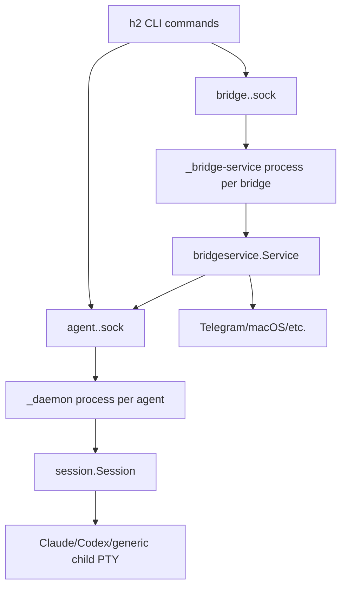
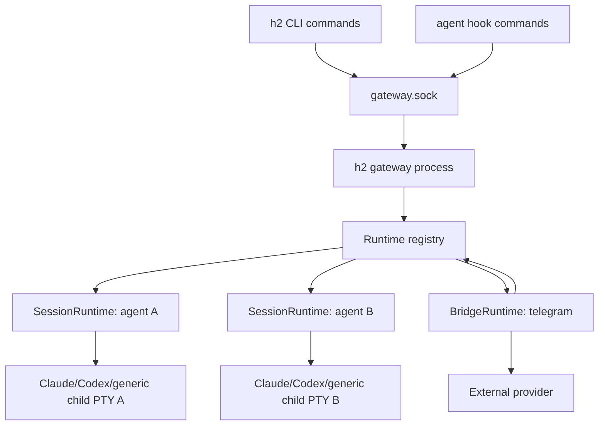
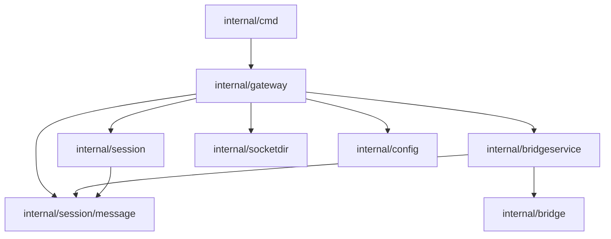

# Gateway Model Plan

## Summary

h2 currently runs one long-lived daemon process per agent session and one long-lived daemon process per bridge service. Each daemon owns its own Unix socket, so CLI commands discover running work by listing `agent.<name>.sock` and `bridge.<name>.sock` files in the h2 socket directory. The gateway model replaces that process topology with one long-running gateway per `H2_DIR`.

The selected design is a single gateway process that owns all agent sessions, all external bridge integrations, all process supervision, and the one public IPC socket for that h2 directory. Agent CLIs such as Claude Code and Codex remain separate child processes running inside PTYs, but they are direct children of the gateway rather than children of per-agent daemon processes. Bridge receivers such as Telegram polling run as goroutines inside the gateway rather than as separate bridge daemons.

The user-facing configuration should not change. Existing role YAML, bridge config, profile config, session metadata, pod launching, attach, send, list, stop, trigger, schedule, rotate, and bridge commands keep their current UX. The implementation replaces the internal runtime transport and process model beneath those commands.

## Shaping

### Requirements

| Req | Requirement | Status |
| --- | --- | --- |
| R0 | One gateway process governs all runtime state for one `H2_DIR`. | Core goal |
| R1 | Agent and bridge config remains unchanged or minimally changed. | Must-have |
| R2 | `h2 run` transparently starts the gateway in the background when needed. | Must-have |
| R3 | The gateway can also run in the foreground under a process supervisor. | Must-have |
| R4 | CLI commands talk to one central communication channel. | Must-have |
| R5 | The gateway is the single process manager for all agent child processes. | Must-have |
| R6 | External bridge integrations are managed centrally and route through the same runtime registry. | Must-have |
| R7 | Existing attach, send, list, stop, trigger, schedule, rotate, bridge, pod, and hook behaviors remain user-transparent. | Must-have |
| R8 | Gateway crash and restart behavior is explicit, testable, and does not corrupt session metadata. | Must-have |

### Shapes Considered

| Shape | Mechanism |
| --- | --- |
| A: Gateway supervises legacy per-agent daemons | Add a gateway that launches and monitors the existing `_daemon` and `_bridge-service` processes, then proxy central RPCs to their existing sockets. |
| B: Gateway embeds sessions and bridges | Add a gateway that owns multiple in-process `SessionRuntime` instances and bridge services. Agent CLIs are direct child processes of the gateway. |
| C: Gateway owns only messaging and bridge routing | Keep one daemon per agent for PTY and lifecycle, but move message routing and bridge integrations into the gateway. |

### Fit Check

| Req | Requirement | Status | A | B | C |
| --- | --- | --- | --- | --- | --- |
| R0 | One gateway process governs all runtime state for one `H2_DIR`. | Core goal | No | Yes | No |
| R1 | Agent and bridge config remains unchanged or minimally changed. | Must-have | Yes | Yes | Yes |
| R2 | `h2 run` transparently starts the gateway in the background when needed. | Must-have | Yes | Yes | Yes |
| R3 | The gateway can also run in the foreground under a process supervisor. | Must-have | Yes | Yes | Yes |
| R4 | CLI commands talk to one central communication channel. | Must-have | Yes | Yes | Yes |
| R5 | The gateway is the single process manager for all agent child processes. | Must-have | No | Yes | No |
| R6 | External bridge integrations are managed centrally and route through the same runtime registry. | Must-have | No | Yes | Yes |
| R7 | Existing attach, send, list, stop, trigger, schedule, rotate, bridge, pod, and hook behaviors remain user-transparent. | Must-have | Yes | Yes | Yes |
| R8 | Gateway crash and restart behavior is explicit, testable, and does not corrupt session metadata. | Must-have | No | Yes | No |

Shape B is selected. Shape A is a useful transitional implementation strategy only if needed to reduce risk, but it does not satisfy the core goal because runtime ownership stays distributed. Shape C improves bridge routing but leaves process management split.

## Current Architecture



Key current boundaries:

| Area | Current owner | Files |
| --- | --- | --- |
| Agent daemon startup | `h2 run` writes `session.metadata.json`, then `session.ForkDaemon` re-execs `_daemon`. | `internal/cmd/run.go`, `internal/cmd/agent_setup.go`, `internal/session/daemon.go`, `internal/cmd/daemon.go` |
| Agent socket protocol | Each `_daemon` listens on one Unix socket and handles `send`, `attach`, `status`, `stop`, `relaunch`, hooks, triggers, and schedules. | `internal/session/listener.go`, `internal/session/message/protocol.go` |
| Session runtime | `Session.RunDaemon` owns PTY, VT buffers, client attach, message queue, monitor, automation, and child relaunch. | `internal/session/session.go` |
| Bridge daemon startup | `h2 bridge create` re-execs `_bridge-service`, then optionally starts a concierge agent. | `internal/cmd/bridge.go`, `internal/cmd/bridge_daemon.go`, `internal/bridgeservice/fork.go` |
| Bridge runtime | `bridgeservice.Service` owns provider receivers, provider senders, concierge routing, typing, and bridge socket control. | `internal/bridgeservice/service.go`, `internal/bridge/*` |
| Discovery | CLI commands list and dial socket files. | `internal/socketdir/socketdir.go`, `internal/cmd/list.go`, `internal/cmd/send.go`, `internal/cmd/attach.go`, `internal/cmd/stop.go` |

## Target Architecture



The gateway becomes the only daemon-like runtime process for one `H2_DIR`. It exposes `gateway.sock`, maintains an in-memory registry of sessions and bridge services, starts and stops child agent processes, and provides all user-visible IPC.

Steady-state socket files:

| Socket | Purpose |
| --- | --- |
| `gateway.sock` | The one public runtime socket for CLI, hooks, attach clients, bridge control, and status. |

Per-agent and per-bridge socket files are removed from steady-state runtime. CLI compatibility is preserved at the command layer by changing commands to call gateway RPCs, not by keeping permanent per-agent socket listeners.

## Package Structure

```text
internal/gateway/
  gateway.go          # Gateway lifecycle, foreground/background startup
  manager.go          # session and bridge registry
  listener.go         # gateway.sock accept loop and request dispatch
  protocol.go         # gateway RPC request/response types
  client.go           # CLI-side gateway RPC client and EnsureRunning
  session_runtime.go  # adapter around session.Session
  bridge_runtime.go   # adapter around bridgeservice.Service
  supervisor.go       # child process supervision, shutdown, restart policy
  recovery.go         # startup scan and stale metadata reconciliation
  state.go            # exported snapshots for list/status
```

Refactors in existing packages:

| Package | Change |
| --- | --- |
| `internal/session` | Split `Daemon` into reusable session runtime pieces. Keep `Session` as the owner of VT, clients, queue, monitor, automation, and child lifecycle. Replace `RunDaemon` with `RunManaged(ctx, opts)` that accepts a listener callback instead of creating a socket. |
| `internal/bridgeservice` | Split provider routing from bridge socket control. Keep `Service` for provider receivers/senders, but inject a `Router` interface instead of dialing agent sockets. Remove bridge socket listener from the service. |
| `internal/socketdir` | Add `TypeGateway` and `GatewayPath`. Keep long-path symlink logic. Stop using `ListByType(TypeAgent)` as the authoritative running-agent registry in normal commands. |
| `internal/cmd` | Replace direct socket discovery with `gateway.Client`. Add `h2 gateway run/start/status/stop`. Keep hidden `_daemon` and `_bridge-service` only until their call sites are fully deleted. |
| `internal/session/message` | Keep queue and attach framing types, but move top-level cross-runtime request types to `internal/gateway/protocol` so agent and bridge control are no longer conflated. |

Import flow:



`internal/session` must not import `internal/gateway`. It receives dependencies through interfaces so the session package can still be unit-tested independently.

## Gateway Lifecycle

### Commands

| Command | Behavior |
| --- | --- |
| `h2 gateway run` | Run the gateway in the foreground. Intended for launchd, systemd, tmux, or another process supervisor. Logs to stderr unless `--log-file` is supplied. |
| `h2 gateway start` | Start the gateway in the background if it is not already running. This is the same mechanism used by `h2 run` auto-start. |
| `h2 gateway status` | Dial `gateway.sock`, print gateway PID, uptime, session count, bridge count, and foreground/background mode as JSON by default. |
| `h2 gateway stop` | Ask the gateway to gracefully stop bridges, stop or detach agent children according to policy, remove `gateway.sock`, and exit. |

### Auto-start

`h2 run`, `h2 bridge create`, `h2 pod launch`, and any command that requires a live runtime call:

```go
client, err := gateway.EnsureRunning(gateway.EnsureOpts{
    Mode: gateway.AutoStartBackground,
    TerminalHints: detectTerminalHints(),
})
```

`EnsureRunning`:

1. Resolves `H2_DIR`.
2. Probes `gateway.sock`.
3. If live, returns a client.
4. If stale, removes it.
5. If missing, re-execs the h2 binary with hidden `_gateway --background`.
6. Waits for `gateway.sock` readiness with an explicit health check.

`h2 gateway run` uses the same `Gateway.Run(ctx)` code path but skips forking and keeps stdio attached.

### Startup Recovery

On startup, the gateway scans:

| Path | Use |
| --- | --- |
| `<H2_DIR>/sessions/*/session.metadata.json` | Discover resumable sessions and recent metadata. |
| `<H2_DIR>/sockets/agent.*.sock` and `bridge.*.sock` | Detect stale legacy socket files and remove only if probing confirms they are dead. |
| `<H2_DIR>/logs/gateway.log` | Append structured lifecycle events. |

The gateway does not automatically resume every historical stopped session. It only starts sessions requested through `h2 run`, `h2 run --resume`, pod launch, or bridge concierge launch. Recovery exists to avoid corrupt metadata, clean stale sockets, and expose stopped sessions in `h2 list --include-stopped`.

## Runtime Model

### Gateway

```go
type Gateway struct {
    h2Dir       string
    socketPath  string
    listener    net.Listener
    registry    *Manager
    log          *slog.Logger
    shutdownCh  chan struct{}
}

func (g *Gateway) Run(ctx context.Context) error
func (g *Gateway) ServeConn(ctx context.Context, conn net.Conn)
func (g *Gateway) Shutdown(ctx context.Context, opts ShutdownOpts) error
```

### Manager

```go
type Manager struct {
    sessions map[string]*SessionRuntime
    bridges  map[string]*BridgeRuntime
    mu       sync.RWMutex
}

func (m *Manager) StartSession(ctx context.Context, req StartSessionRequest) (*AgentSnapshot, error)
func (m *Manager) ResumeSession(ctx context.Context, req ResumeSessionRequest) (*AgentSnapshot, error)
func (m *Manager) StopSession(ctx context.Context, name string) error
func (m *Manager) RelaunchSession(ctx context.Context, name string, opts RelaunchOpts) error
func (m *Manager) AttachSession(ctx context.Context, name string, conn net.Conn, opts AttachOpts) error
func (m *Manager) SendToSession(ctx context.Context, req SendRequest) (*SendResponse, error)
func (m *Manager) StartBridge(ctx context.Context, req StartBridgeRequest) (*BridgeSnapshot, error)
func (m *Manager) StopBridge(ctx context.Context, name string) error
func (m *Manager) List(ctx context.Context, opts ListOpts) (*RuntimeSnapshot, error)
```

The manager is the only component allowed to mutate the runtime registry. It enforces unique agent and bridge names before child process launch.

### SessionRuntime

```go
type SessionRuntime struct {
    name       string
    sessionDir string
    rc         *config.RuntimeConfig
    session    *session.Session
    cancel     context.CancelFunc
    done       chan error
}

func (r *SessionRuntime) Start(ctx context.Context, opts session.ManagedOpts) error
func (r *SessionRuntime) Attach(ctx context.Context, conn net.Conn, opts AttachOpts) error
func (r *SessionRuntime) Send(req SendRequest) (*SendResponse, error)
func (r *SessionRuntime) Stop(ctx context.Context) error
func (r *SessionRuntime) Snapshot() AgentSnapshot
```

`SessionRuntime.Start` calls `session.NewFromConfig`, wires automation and monitor callbacks, then starts the child PTY directly. There is no `_daemon` re-exec. `SessionRuntime.Attach` creates a `client.Client` and reuses the existing framed attach protocol over the gateway connection after the gateway has selected the target session.

### BridgeRuntime

```go
type BridgeRuntime struct {
    name    string
    service *bridgeservice.Service
    cancel  context.CancelFunc
    done    chan error
}

type BridgeRouter interface {
    SendToAgent(ctx context.Context, agentName, from, body string, opts SendOpts) (*SendResponse, error)
    FirstAvailableAgent(ctx context.Context) string
    AgentState(ctx context.Context, agentName string) (monitor.State, monitor.SubState, error)
}
```

`bridgeservice.Service` no longer opens or listens on a bridge socket. Inbound provider messages call `BridgeRouter.SendToAgent` directly. Outbound agent-to-bridge messages go through the manager, which finds the bridge runtime in memory and calls `Service.SendOutbound`.

## Gateway Protocol

The gateway socket uses the same JSON request/response handshake for simple commands and the same frame format for attach data/control streams. The top-level request must include the target object where needed.

```go
type Request struct {
    Type string `json:"type"`

    AgentName  string `json:"agent_name,omitempty"`
    BridgeName string `json:"bridge_name,omitempty"`

    StartSession *StartSessionSpec `json:"start_session,omitempty"`
    StartBridge  *StartBridgeSpec  `json:"start_bridge,omitempty"`
    Send         *SendSpec         `json:"send,omitempty"`
    Attach       *AttachSpec       `json:"attach,omitempty"`
    Trigger      *TriggerSpec      `json:"trigger,omitempty"`
    Schedule     *ScheduleSpec     `json:"schedule,omitempty"`
    Relaunch     *RelaunchSpec     `json:"relaunch,omitempty"`
}
```

Request types:

| Type | Target | Behavior |
| --- | --- | --- |
| `health` | gateway | Returns PID, version, uptime, and `H2_DIR`. |
| `start_session` | gateway | Starts an agent from an already-resolved runtime config and session dir. |
| `resume_session` | gateway | Starts an agent with `ResumeSessionID` set from metadata. |
| `attach_session` | agent | Performs attach handshake, then upgrades the connection to framed attach mode. |
| `send_session` | agent | Enqueues normal or raw input into the session queue. |
| `show_message` | agent | Reads a queued message by ID. |
| `session_status` | agent | Returns one agent snapshot. |
| `list_runtime` | gateway | Returns all live agent and bridge snapshots plus stopped metadata if requested. |
| `stop_session` | agent | Gracefully stops an agent child and removes it from the live registry. |
| `relaunch_session` | agent | Reuses the current `SessionRuntime` and restarts the child after config reload. |
| `hook_event` | agent | Routes harness hook JSON to the named session. |
| `trigger_add`, `trigger_list`, `trigger_remove` | agent | Operates on that session's automation engine. |
| `schedule_add`, `schedule_list`, `schedule_remove` | agent | Operates on that session's schedule engine. |
| `start_bridge` | gateway | Starts bridge providers from existing config. |
| `stop_bridge` | bridge | Stops a bridge runtime. |
| `bridge_status` | bridge | Returns one bridge snapshot. |
| `bridge_set_concierge`, `bridge_remove_concierge` | bridge | Mutates bridge routing state. |
| `gateway_stop` | gateway | Gracefully stops the gateway. |

`Response` retains current public `AgentInfo`, `BridgeInfo`, `MessageInfo`, trigger, and schedule payloads where possible. This reduces CLI output churn.

## CLI Changes

| Command | Gateway change |
| --- | --- |
| `h2 run` | Build and write runtime config as today, then call `start_session` instead of `ForkDaemon`. Auto-start gateway first. Attach uses `attach_session`. |
| `h2 run --resume` | Read existing runtime config as today, then call `resume_session`. |
| `h2 attach <name>` | Dial `gateway.sock`, send `attach_session` with name and terminal hints, then use existing framed attach stream. |
| `h2 send <name>` | Dial gateway and call `send_session`. `--expects-response` trigger registration becomes one gateway transaction to prevent orphan triggers. |
| `h2 send --closes` | Dial gateway for sender trigger removal and optional response send. |
| `h2 list` | Call `list_runtime`; stopped session scanning moves into gateway or a shared helper used by both gateway and tests. |
| `h2 status <name>` | Call `session_status`. |
| `h2 stop <name>` | Call `stop_session` or `stop_bridge` after gateway resolves the name. Ambiguous agent/bridge names return a deterministic error. |
| `h2 bridge create` | Call `start_bridge`; if concierge launch is requested, call `start_session` for `concierge`. |
| `h2 bridge stop/set-concierge/remove-concierge` | Call gateway bridge RPCs. |
| `h2 trigger`, `h2 schedule`, `h2 rotate`, `h2 session restart`, `h2 peek`, `h2 stats` | Replace direct socket calls with gateway client calls. File-based event and runtime metadata reads can stay as-is where they do not require live state. |
| `h2 handle-hook` | Use `H2_ACTOR` or `H2_SESSION_DIR` to address `hook_event` through gateway. |

## Metadata and Config

No user-facing config changes are required.

`config.RuntimeConfig` keeps its current role, harness, profile, CWD, session ID, and automation fields. Add internal-only fields only if implementation needs them:

```go
GatewayPID        int    `json:"gateway_pid,omitempty"`
GatewayGeneration string `json:"gateway_generation,omitempty"`
LastExitReason    string `json:"last_exit_reason,omitempty"`
```

These are diagnostic fields, not user configuration. They must not be required by `Validate`, because older session metadata must remain readable.

Bridge config remains in `config.yaml` exactly as today. `bridgeservice.FromConfig` remains the bridge construction point.

## Process Management

The gateway is the parent process for every agent child. It is responsible for:

| Responsibility | Design |
| --- | --- |
| Start | Resolve role/config in the CLI, write runtime config, ask gateway to start. Gateway reads the same file and starts the PTY child. |
| Stop | `stop_session` sets `Session.Quit`, kills the child PTY if needed, drains shutdown hooks, and removes the session from the live registry. |
| Relaunch | `relaunch_session` uses the existing `Session` lifecycle loop behavior, but the request enters through gateway. |
| Gateway shutdown | Default graceful stop sends stop to bridge receivers, then stops agent children. A later feature can add `--leave-children`, but the initial gateway model should not orphan agent PTYs. |
| Gateway crash | Child PTYs die with the gateway on normal OS process semantics. Sessions remain resumable through metadata if the harness supports resume. |

Foreground supervisors should run `h2 gateway run`. Background auto-start should use a detached `_gateway` hidden command with stderr redirected to `<H2_DIR>/logs/gateway.log`.

## State and Concurrency

State ownership:

| State | Owner |
| --- | --- |
| Live session registry | `gateway.Manager` |
| Per-agent VT, clients, queue, monitor, automation | `session.Session` |
| Bridge provider clients and counters | `bridgeservice.Service` |
| Runtime metadata on disk | `config.WriteRuntimeConfig` call sites in CLI and session monitor callbacks |
| Event logs | Existing `eventstore.EventStore` per session |

Concurrency rules:

1. Manager registry mutations take `Manager.mu`.
2. A `SessionRuntime` method never calls back into manager while holding `Session` internal locks.
3. Attach streams are long-lived and owned by `SessionRuntime.Attach` after initial gateway dispatch.
4. Bridge inbound handlers call manager methods without holding bridge locks.
5. Gateway shutdown first stops bridge receivers to prevent new inbound work, then stops sessions.

## Migration Plan

### Phase 1: Gateway skeleton and health

Add `internal/gateway`, `socketdir.TypeGateway`, hidden `_gateway`, and public `h2 gateway run/start/status/stop`. Implement `health`, foreground mode, background auto-start, stale socket cleanup, and structured logging. No agent behavior changes yet.

### Phase 2: Start sessions through gateway

Refactor `session.RunDaemon` into `Session.RunManaged(ctx, opts)` and `SessionRuntime`. Change `h2 run`, `h2 run --resume`, and `h2 pod launch` to call gateway `start_session`/`resume_session`. Delete the call path to `session.ForkDaemon` after tests pass.

### Phase 3: Move agent command RPCs

Move `attach`, `send`, `show`, `status`, `stop`, `trigger`, `schedule`, `rotate`, `session restart`, `handle-hook`, `peek`, and `stats` to gateway RPCs. Remove per-agent socket creation from session startup.

### Phase 4: Move bridges into gateway

Refactor `bridgeservice.Service` to accept a `BridgeRouter`. Change `h2 bridge create/stop/set-concierge/remove-concierge` to call gateway. Remove `_bridge-service`, `bridgeservice.ForkBridge`, and bridge socket creation.

### Phase 5: Cleanup and compatibility boundary removal

Remove old per-agent and per-bridge socket discovery from normal commands. Keep `socketdir` only for `gateway.sock` path resolution and stale legacy cleanup. Update docs and README runtime directory descriptions.

## Acceptance Criteria

| Scenario | Steps | Expected outcome |
| --- | --- | --- |
| Transparent first launch | Stop all h2 runtime processes. Run `h2 run test-agent --role default --detach`. Run `h2 gateway status`. Run `h2 list`. | `h2 run` starts one gateway process in the background, starts one agent child, and `h2 list` shows the agent without any per-agent daemon process. |
| Foreground supervised gateway | Run `h2 gateway run` in one terminal. In another terminal run `h2 run test-agent --role default --detach`, `h2 send test-agent "hello"`, and `h2 stop test-agent`. | The existing foreground gateway handles all commands; no background gateway is forked. |
| Attach through gateway | Start an agent. Run `h2 attach <agent>`, resize the terminal, send input, toggle passthrough, detach by closing attach. Reattach. | The same terminal behavior works through `gateway.sock`, including resize frames and persisted VT scrollback. |
| Bridge routing through gateway | Configure Telegram test bridge or fake bridge. Run `h2 bridge create --bridge test --set-concierge <agent>`. Send inbound provider messages with and without explicit agent prefixes. | Bridge provider runs inside gateway, inbound messages reach the selected session without dialing agent sockets, outbound replies are tagged as before. |
| Gateway restart after crash | Start a resumable agent, kill the gateway process with SIGKILL, then run `h2 run <agent> --resume --detach`. | Stale `gateway.sock` is removed, a new gateway starts, metadata remains readable, and the agent resumes using existing harness session metadata. |
| Pod launch | Run `h2 pod launch <pod>` for a pod with multiple agents and optional bridge. Run `h2 list --pod <pod>`. Stop the pod. | One gateway owns all pod agents and bridge runtime; pod ordering and stop behavior match current CLI semantics. |
| Hook delivery | Launch a Claude agent with hooks enabled. Trigger tool-use and permission hooks. | `h2 handle-hook` sends hook events to gateway and the correct session monitor updates state and activity logs. |

## Testing

| Category | Location | Runner | CI tier |
| --- | --- | --- | --- |
| Gateway protocol unit tests | `internal/gateway/*_test.go` | `make test` | PR |
| Gateway manager concurrency tests | `internal/gateway/manager_test.go` | `make test` | PR |
| Session managed runtime tests | `internal/session/*_test.go`, new `internal/gateway/session_runtime_test.go` | `make test` | PR |
| Bridge router tests | `internal/bridgeservice/*_test.go`, new `internal/gateway/bridge_runtime_test.go` | `make test` | PR |
| CLI command tests | `internal/cmd/*_test.go` | `make test` | PR |
| External CLI integration tests | `tests/external/gateway_test.go` | `make test-external` | PR |
| Soak and fault-injection tests | `tests/external/gateway_fault_test.go` with `-run GatewayFault` | `make test-external` initially on-demand, later nightly | On-demand/nightly |

All tests must follow the project rule: never use `config.ConfigDir()` against the real h2 directory in tests. Use fake home setup and reset config/socket caches.

## Unreasonably Robust Programming

| Commitment | Implementation | Test |
| --- | --- | --- |
| Atomic session metadata remains the source of truth for resume | Keep `config.WriteRuntimeConfig` atomic writes and add gateway generation fields only as optional diagnostics. | Existing `internal/config/runtime_config_test.go` plus new crash-recovery tests in `internal/gateway/recovery_test.go`. |
| Single-transaction expects-response delivery | Gateway `send_session` registers the reminder trigger and message enqueue under one session operation; if enqueue fails, the trigger is removed before response. | `internal/gateway/manager_test.go` validates no orphan triggers for injected send failure. |
| Deterministic stale socket cleanup | Gateway startup probes old `agent.*.sock`, `bridge.*.sock`, and `gateway.sock`; removes only dead sockets. | `internal/gateway/recovery_test.go` creates live and stale Unix sockets and verifies only stale files are removed. |
| Runtime invariant checker | Add `Gateway.CheckInvariants()` asserting unique names, registry/session metadata agreement for live sessions, no nil cancel/done handles, and bridge concierge references are either empty or known/stopped-explicit. | Unit property tests and external smoke test call `gateway debug-invariants` or internal test helper after lifecycle operations. |
| Structured lifecycle journal | Gateway writes JSONL events for start, stop, child exit, bridge start/stop, stale cleanup, and crash recovery to `<H2_DIR>/logs/gateway-events.jsonl`. | `internal/gateway/state_test.go` verifies event schema and ordering for deterministic lifecycle actions. |

## Extreme Optimization

No low-level CPU optimization is justified in this design. The hot paths are IPC dispatch, PTY frame copy, bridge HTTP polling, and state snapshot assembly. The concrete performance commitment is to avoid unnecessary socket fanout: in-process bridge-to-session delivery removes two Unix socket round trips per inbound bridge message.

Measurement:

| Benchmark | Location | Runner | Target |
| --- | --- | --- | --- |
| Gateway send dispatch | `internal/gateway/bench_test.go` | `go test -bench GatewaySend ./internal/gateway` | Median in-process dispatch below current socket-based bridge-to-agent dispatch by at least 30% on the same machine. |
| List snapshot with 100 sessions | `internal/gateway/bench_test.go` | `go test -bench GatewayList ./internal/gateway` | Snapshot allocation count remains bounded and no per-session socket dial occurs. |

## Alien Artifacts

No advanced mathematical or research technique is required for the first gateway migration. The risk is systems integration correctness, not algorithmic complexity. The plan intentionally keeps the design observable and deterministic rather than introducing exotic coordination algorithms.

## Open Questions

| Question | Proposed answer |
| --- | --- |
| Should gateway shutdown stop all child agents? | Yes for the initial gateway model. Child PTYs are owned by gateway and should not be orphaned. Resume handles recovery. |
| Should per-agent sockets exist as aliases? | No in steady state. The goal is one central channel. CLI transparency comes from updating commands to call gateway. |
| Should gateway auto-start for read-only commands like `h2 list`? | `h2 list` should auto-start only when needed for live runtime inspection. If no gateway exists, it can still show stopped sessions with `--include-stopped` by reading metadata directly or through a short-lived helper path. |
| Can multiple gateways run for different h2 dirs? | Yes. The socket path is derived from `H2_DIR`, so each h2 directory has its own gateway. |
