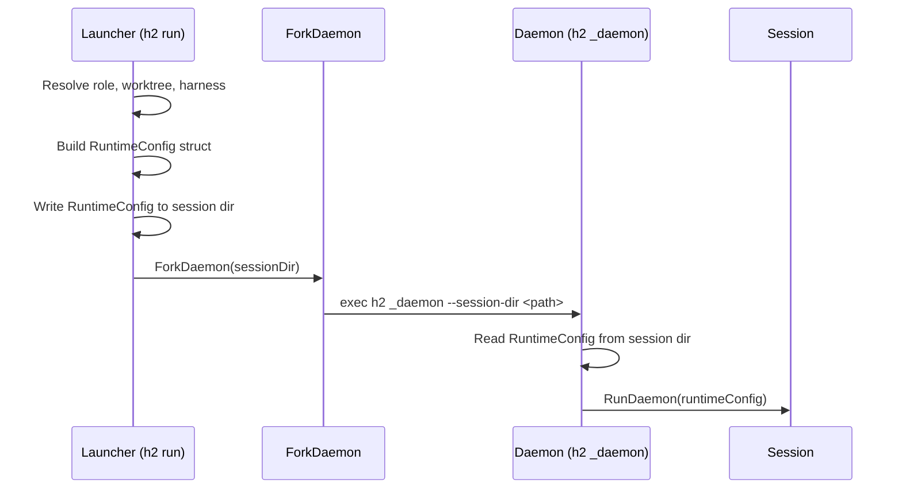
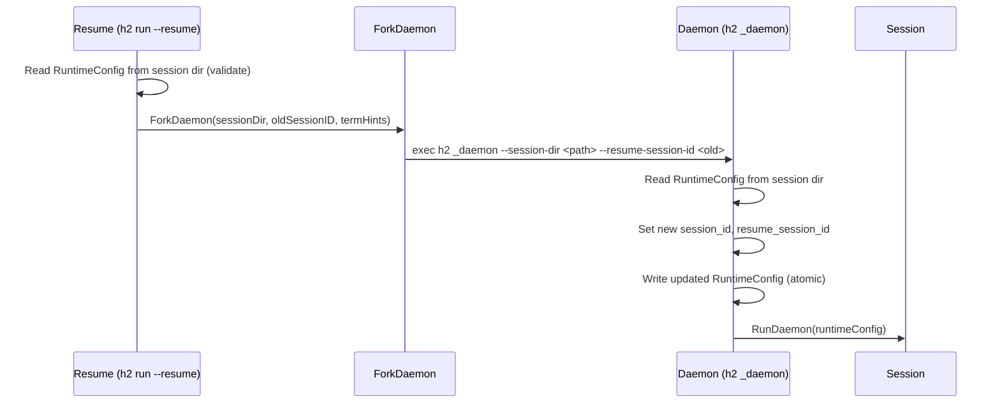

# Runtime Config: Unified Session Launch & Resume

## Problem

The daemon launch pipeline currently passes ~20 individual CLI flags from the launcher to the daemon process, and then writes a lossy subset of them into `session.metadata.json`. This creates three problems:

1. **Data loss on resume**: The metadata file is missing `instructions`, `system_prompt`, `model`, `claude_permission_mode`, `codex_sandbox_mode`, `codex_ask_for_approval`, `additional_dirs`, `heartbeat`, and `args`. Resumed agents silently lose all of these.

2. **No protection against role drift**: Resume reads from session metadata, not the role file — but because the metadata is incomplete (missing instructions, model, permissions, etc.), any future change that adds role re-resolution to fill gaps would silently pick up edited role values. Storing the complete realized config in metadata eliminates this class of bug by design.

3. **`claude_config_dir` is always blank**: The metadata writes `claude_config_dir` by calling `BuildCommandEnvVars()` on the minimal harness (created before `setupAgent()` runs), which doesn't have the config dir set. This means resume can never restore the correct harness config dir.

4. **CLI flag sprawl**: Every new role field requires adding a flag to `ForkDaemonOpts`, `ForkDaemon()`, `newDaemonCmd()`, and `RunDaemonOpts`, plus wiring it through the metadata write and resume read paths. This is ~6 touch points per field.

## Proposal

Replace the individual CLI flags with a single serialized JSON config file. The launcher writes the fully-resolved config to `session.metadata.json`, the daemon reads it to launch, and resume reads the same file to relaunch. The runtime config becomes both the daemon's input and the session's persistent record.

### High-Level Flow





### RuntimeConfig Struct

This replaces both `SessionMetadata`, `ForkDaemonOpts`, and `RunDaemonOpts` as the single source of truth. All values are fully resolved (absolute paths, rendered templates, parsed durations).

```go
// package: config

// RuntimeConfig is the fully-resolved, serialized configuration for a daemon
// session. It is written to <session-dir>/session.metadata.json by the launcher
// and read by the daemon on startup. It serves as both the daemon's input
// config and the persistent session record for resume and tooling (peek, stats).
type RuntimeConfig struct {
    // Identity & provenance.
    AgentName string `json:"agent_name"`
    SessionID string `json:"session_id"`
    RoleName  string `json:"role,omitempty"`
    Pod       string `json:"pod,omitempty"`

    // Harness configuration.
    HarnessType      string   `json:"harness_type"`
    HarnessConfigDir string   `json:"harness_config_dir,omitempty"`
    // HarnessSessionID is the session ID as known by the underlying harness
    // (e.g. Claude Code's session UUID, Codex's conversation.id). For harnesses
    // that accept a session-id input arg (currently just Claude Code), this will
    // equal SessionID since h2 generates the UUID and passes it through. For
    // other harnesses (Codex, future), this is reported async after launch and
    // will differ from SessionID. Use HarnessSessionID to look up session logs
    // in the harness's own config directory.
    HarnessSessionID string   `json:"harness_session_id,omitempty"`
    Command          string   `json:"command"`
    Args             []string `json:"args,omitempty"`
    Model            string   `json:"model,omitempty"`

    // Working directory.
    CWD string `json:"cwd"`

    // Prompt configuration.
    Instructions string `json:"instructions,omitempty"`
    SystemPrompt string `json:"system_prompt,omitempty"`

    // Permission configuration.
    ClaudePermissionMode string `json:"claude_permission_mode,omitempty"`
    CodexSandboxMode     string `json:"codex_sandbox_mode,omitempty"`
    CodexAskForApproval  string `json:"codex_ask_for_approval,omitempty"`

    // Additional directories.
    AdditionalDirs []string `json:"additional_dirs,omitempty"`

    // Heartbeat nudge configuration.
    HeartbeatIdleTimeout string `json:"heartbeat_idle_timeout,omitempty"` // Go duration string
    HeartbeatMessage     string `json:"heartbeat_message,omitempty"`
    HeartbeatCondition   string `json:"heartbeat_condition,omitempty"`

    // Overrides (recorded for display/debugging).
    Overrides map[string]string `json:"overrides,omitempty"`

    // Resume support.
    ResumeSessionID string `json:"resume_session_id,omitempty"`

    // Timestamps.
    StartedAt string `json:"started_at"`

    // --- Deprecated fields for backward compatibility on read ---
    // ClaudeConfigDir was the old field name; mapped to HarnessConfigDir on load.
    ClaudeConfigDir string `json:"claude_config_dir,omitempty"`
}
```

**Session ID and the harness session ID problem:**

The `session_id` in RuntimeConfig is h2's own UUID, generated by the launcher before forking. For Claude Code, this same UUID is passed via `--session-id` to the child process, so they're always in sync.

For Codex, h2's UUID is NOT the harness's internal session ID. Codex generates its own `conversation.id` which arrives via OTEL in the `codex.conversation_starts` event. Currently this is stored as `ThreadID` on the monitor's `SessionStartedData` but never written back to session metadata. This means we can't use the metadata to look up Codex session logs in its config directory.

**Fix**: Add a `harness_session_id` field to RuntimeConfig. This field:
- Is written as empty at launch time (placeholder)
- Gets updated by the daemon once the harness reports its session ID
- For Claude Code: set immediately (it's the same as h2's `session_id`)
- For Codex: set when `EventSessionStarted` fires with the `conversation.id`

The monitor already stores this via `SessionStartedData.ThreadID`. Rename `ThreadID` to `SessionID` on `SessionStartedData` to normalize the naming across harnesses. The daemon wires a callback from the monitor to update the RuntimeConfig file when this value arrives:

```go
// In RunDaemon, after setupAgent:
s.monitor.OnSessionID = func(harnessSessionID string) {
    rc.HarnessSessionID = harnessSessionID
    config.WriteRuntimeConfig(s.SessionDir, rc)
}
```

This keeps the metadata file as the single source of truth and ensures resume can find the harness's session logs.

**Notes on field choices:**
- `HeartbeatIdleTimeout` is stored as a Go duration string (e.g. `"30s"`) rather than a `time.Duration` (which doesn't JSON-marshal well). Parsed on load.
- `Overrides` is kept for provenance/debugging display only. The override values are already applied to the resolved fields.
- `ClaudeConfigDir` is kept as a deprecated read-only field so that existing metadata files from older sessions can still be resumed. On load, if `HarnessConfigDir` is empty but `ClaudeConfigDir` is set, it's migrated.
- Terminal color hints (`OscFg`, `OscBg`, `ColorFGBG`, `Term`, `ColorTerm`) are NOT stored. They're properties of the launching terminal, re-detected fresh on each launch/resume and passed via env vars to the forked process.

### What Gets Removed

| Current | Replacement |
|---------|-------------|
| `session.SessionMetadata` struct | `config.RuntimeConfig` |
| `session.ForkDaemonOpts` (~25 fields) | `config.RuntimeConfig` + terminal hints |
| `session.RunDaemonOpts` (~20 fields) | `config.RuntimeConfig` |
| `newDaemonCmd()` with ~15 CLI flags | Single `--session-dir` flag |
| `ForkDaemon()` building ~20 CLI args | Writes JSON, passes one flag |
| Lossy metadata write in `RunDaemon()` | Metadata already written by launcher |

### ForkDaemon Simplification

Before (conceptual):
```go
func ForkDaemon(opts ForkDaemonOpts) error {
    args := []string{"_daemon",
        "--name", opts.Name,
        "--session-id", opts.SessionID,
        "--role", opts.RoleName,
        "--instructions", opts.Instructions,
        // ... 15+ more flags
    }
    cmd := exec.Command(exe, args...)
    // ... env vars for terminal hints
}
```

After:
```go
func ForkDaemon(sessionDir string, resumeSessionID string, termHints TerminalHints) error {
    args := []string{"_daemon", "--session-dir", sessionDir}
    if resumeSessionID != "" {
        args = append(args, "--resume-session-id", resumeSessionID)
    }
    cmd := exec.Command(exe, args...)
    // ... env vars for terminal hints only
}
```

### Daemon Startup Simplification

Before:
```go
func newDaemonCmd() *cobra.Command {
    var name, sessionID, roleName, instructions, model string
    var harnessType, harnessConfigDir, permissionMode string
    // ... 15 more vars, 15 more flag declarations
    RunE: func(cmd *cobra.Command, args []string) error {
        // parse overrides, heartbeat duration
        // build RunDaemonOpts from all the individual vars
        session.RunDaemon(opts)
    }
}
```

After:
```go
func newDaemonCmd() *cobra.Command {
    var sessionDir string
    RunE: func(cmd *cobra.Command, args []string) error {
        rc, err := config.ReadRuntimeConfig(sessionDir)
        session.RunDaemon(rc)
    }
}
```

### Resume Simplification

Before (`runResume`):
```go
meta, _ := config.ReadSessionMetadata(sessionDir)
harnessType := meta.HarnessType
// ... infer missing fields, re-resolve harness
forkDaemonFunc(session.ForkDaemonOpts{
    Name:             name,
    SessionID:        newSessionID,
    ResumeSessionID:  meta.SessionID,
    Command:          meta.Command,
    HarnessType:      harnessType,
    HarnessConfigDir: meta.ClaudeConfigDir, // always blank!
    CWD:              meta.CWD,
    Pod:              meta.Pod,
    // instructions, model, permissions, heartbeat: LOST
})
```

After:
```go
rc, err := config.ReadRuntimeConfig(sessionDir)
if err != nil {
    return fmt.Errorf("cannot resume agent %q: %w", name, err)
    // e.g. "cannot resume agent "coder-1": invalid runtime config: missing required fields: harness_type, command"
}
// Don't mutate the metadata file here — the daemon will update it after
// successful startup. Pass the old session ID as a CLI flag so the daemon
// can set resume_session_id and generate a new session_id.
forkDaemon(sessionDir, rc.SessionID, detectTerminalHints())
```

All fields are preserved. The resumed agent gets exactly the same instructions, model, permissions, heartbeat, etc. as the original. If the metadata is incomplete or corrupt, resume fails loudly with the specific missing fields, giving the user the option to manually fix `session.metadata.json` and retry. The metadata file is not mutated until the daemon starts successfully.

### Dry-Run Impact

`ResolvedAgentConfig` in `dry_run.go` currently holds a mix of resolved values and the raw `Role` pointer. With this change, the dry-run path can build a `RuntimeConfig` and display it directly, or keep `ResolvedAgentConfig` as a display-only wrapper that adds fields like `IsWorktree` and `RoleScope` that are only relevant for display. The `RuntimeConfig` gives dry-run all the resolved values it needs without needing the Role object.

### Strict Validation on Load

`ReadRuntimeConfig` performs strict validation: required fields must be present and non-empty, or the load fails with an explicit error naming the missing fields. This prevents silent degradation where an agent resumes without its instructions, model, or permissions because a field was renamed or lost.

**Required fields** (must be non-empty):
- `agent_name`
- `session_id`
- `harness_type`
- `command`
- `cwd`
- `started_at`

All other fields are optional — if they're empty/missing, they get zero values. There is no mechanism to detect whether an optional field was intentionally empty vs. lost due to a rename. If an optional field (e.g. `instructions`, `model`) is lost, the resumed agent will behave differently, but this is the user's responsibility to notice. The `--dry-run` flag on resume can help verify the config before launching.

**Read implementation**:

```go
func ReadRuntimeConfig(sessionDir string) (*RuntimeConfig, error) {
    // ... read file, unmarshal ...

    // One-time migrations for renamed fields.
    if rc.HarnessConfigDir == "" && rc.ClaudeConfigDir != "" {
        rc.HarnessConfigDir = rc.ClaudeConfigDir
        rc.ClaudeConfigDir = "" // clear deprecated field
    }

    // Validate required fields.
    var missing []string
    if rc.AgentName == "" { missing = append(missing, "agent_name") }
    if rc.SessionID == "" { missing = append(missing, "session_id") }
    if rc.HarnessType == "" { missing = append(missing, "harness_type") }
    if rc.Command == "" { missing = append(missing, "command") }
    if rc.CWD == "" { missing = append(missing, "cwd") }
    if rc.StartedAt == "" { missing = append(missing, "started_at") }
    if len(missing) > 0 {
        return nil, fmt.Errorf("invalid runtime config: missing required fields: %s",
            strings.Join(missing, ", "))
    }

    return rc, nil
}
```

If a future version renames a required field (e.g. `command` -> `executable`), old metadata files will fail with:
```
invalid runtime config: missing required fields: executable
```

The user can then manually edit `session.metadata.json` to add the new field and retry, or choose not to resume that session.

**No silent fallback inference**: The current resume code infers `harness_type` from `command` when `harness_type` is missing. This is removed. Old sessions from before `harness_type` was added will fail to resume with a clear error. This is acceptable — those sessions are from an older h2 version and the user can manually add `"harness_type": "claude_code"` to the metadata file if they want to resume.

**Breaking change for resume of pre-RuntimeConfig sessions**: This is explicitly a breaking change for `h2 run --resume` on sessions created before this change. The error message will name the missing fields so users can manually patch the metadata JSON if needed. This should be noted in CHANGELOG.md.

**Non-breaking for stats/peek**: `h2 stats` and `h2 peek` read only a subset of fields (`role`, `command`) and use inline struct decoding, so they continue to work with both old and new metadata formats.

**Writing**: New sessions always write the full `RuntimeConfig`. No need to support writing old format.

### Atomic Writes

All writes to `session.metadata.json` use atomic write-to-temp + rename to prevent corruption from concurrent readers (stats, peek, find-by-id) or crashes mid-write:

```go
func WriteRuntimeConfig(sessionDir string, rc *RuntimeConfig) error {
    path := filepath.Join(sessionDir, "session.metadata.json")
    data, _ := json.MarshalIndent(rc, "", "  ")
    tmp := path + ".tmp"
    if err := os.WriteFile(tmp, data, 0o644); err != nil {
        return err
    }
    return os.Rename(tmp, path)
}
```

This applies to all write sites: initial launcher write, daemon startup update on resume (new session ID), and daemon async update (harness session ID). The launcher and daemon are the only writers; resume (the `h2 run --resume` CLI path) does not write to the metadata file.

### Non-Destructive Resume

Resume must not mutate the existing metadata before the new daemon is confirmed running. The flow is:

1. Read existing `session.metadata.json` (the canonical record of the previous session)
2. Fork the daemon, passing `--session-dir` and `--resume-session-id` (the old session ID) as CLI flags
3. The **daemon** writes the updated metadata (new `session_id`, `resume_session_id` set) after it starts successfully

This means if the fork fails, the original metadata is untouched and the user can retry. The daemon owns the metadata file once it starts — this is already the case for the async `harness_session_id` update, so resume follows the same pattern.

For this to work, `--resume-session-id` stays as one of the few CLI flags alongside `--session-dir` on the `_daemon` command (since the daemon needs to know the old session ID to pass to the harness's `--resume` flag, but the metadata file still contains the old session's `session_id` at fork time).

### Stats / Peek Consumers

`h2 stats` reads `session.metadata.json` to get `role` and `command`. These fields remain in the same positions in the JSON, so stats continues to work with zero changes. The extra fields in `RuntimeConfig` are simply ignored by stats' inline struct decode.

`h2 peek` uses `AgentInfo()` from the daemon's live socket, not the metadata file, so it's unaffected.

## Package Structure

```
internal/config/
    runtime_config.go       # RuntimeConfig struct, Read/Write functions
    session_dir.go          # Remove SessionMetadata, keep SetupSessionDir, EnsureClaudeConfigDir

internal/session/
    daemon.go               # RunDaemon takes RuntimeConfig instead of RunDaemonOpts
                            # ForkDaemon takes sessionDir + TerminalHints
                            # Remove ForkDaemonOpts, RunDaemonOpts

internal/cmd/
    daemon.go               # Simplify to single --session-dir flag
    run.go                  # setupAndForkAgent writes RuntimeConfig, calls simplified ForkDaemon
    agent_setup.go          # Build RuntimeConfig from resolved role
    dry_run.go              # Build RuntimeConfig for display (no changes to output format)
```

## Migration Path

This can be done as a single PR since:
- The serialization format (`session.metadata.json`) is read-compatible for consumers like stats/peek (superset of old fields). Resume compatibility is intentionally breaking for pre-RuntimeConfig sessions (documented in CHANGELOG)
- The CLI change (`_daemon` flags) is internal-only (never called by users)
- No external API changes

Steps:
1. Create `RuntimeConfig` struct in `config/runtime_config.go` with atomic read/write/validate functions (write-to-temp + rename)
2. Rename `SessionStartedData.ThreadID` to `SessionStartedData.SessionID` across monitor, event handlers, and tests
3. Add `OnSessionID` callback to `AgentMonitor` — fires when `EventSessionStarted` arrives, daemon uses this to atomically write `harness_session_id` back to the RuntimeConfig file
4. Update `agent_setup.go` to build `RuntimeConfig` and write it before forking
5. Simplify `ForkDaemon` to take `sessionDir` + `resumeSessionID` + `TerminalHints`
6. Simplify `newDaemonCmd` to read `RuntimeConfig` from `--session-dir`, accept `--resume-session-id` for resume
7. Update `RunDaemon` to take `*RuntimeConfig` instead of `RunDaemonOpts`, wire `OnSessionID` callback, update metadata with new `session_id`/`resume_session_id` on successful startup
8. Simplify `runResume` to read/validate `RuntimeConfig` (no mutation), pass old session ID to fork
9. Remove `SessionMetadata`, `ForkDaemonOpts`, `RunDaemonOpts`
10. Update tests
11. Add CHANGELOG entry noting breaking change for resume of pre-RuntimeConfig sessions

## Testing

### Unit Tests

- `runtime_config_test.go`:
  - Round-trip write/read preserves all fields exactly
  - **Validation rejects missing required fields** with specific field names in error
  - **Validation rejects empty required fields** (e.g. `"command": ""`)
  - `claude_config_dir` migration to `harness_config_dir` on read
  - Old metadata without `harness_type` fails validation (no silent inference)
  - Optional fields that are empty/missing are allowed (e.g. `model`, `instructions`)
- `resume_test.go`:
  - Update existing tests to use `RuntimeConfig`
  - **All fields survive resume round-trip** (write config, read it back for resume, verify every field matches)
  - **Resume fails cleanly on corrupt/incomplete metadata** with actionable error message
  - Resume of old-format metadata (pre-RuntimeConfig) fails with clear error about missing fields
- `agent_setup_test.go`: Verify `RuntimeConfig` written to session dir contains all expected fields from role

### Integration Tests

- Launch an agent, verify `session.metadata.json` contains all role-derived fields
- Resume an agent, verify the daemon receives the same config (instructions, model, permissions, heartbeat)
- **Resume with old/incomplete metadata fails with descriptive error**

### Manual Verification

- `h2 run --dry-run` output should be unchanged
- `h2 stats` output should be unchanged
- `h2 run <name> --resume` should restore instructions, model, and permissions
- `h2 run <name> --resume` on a session from before this change should fail with a clear message about missing fields, not silently launch a broken session
