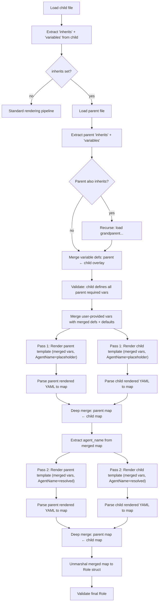

# Role Inheritance Design

## Summary

Roles can inherit from a parent role via an `inherits` field. The child role's configuration is layered on top of the parent's: variable definitions are merged, both templates are rendered with the merged variable set, and the resulting YAML configs are deep-merged with the child's values winning.

This enables creating a base role with common configuration (harness, permissions, shared instructions) and deriving specialized roles that override specific fields or narrow/widen the variable contract.

## Architecture

### New Role Field

```yaml
# child-role.yaml.tmpl
role_name: backend-coder
inherits: coder          # references parent role by name
agent_model: claude-sonnet-4-6
instructions: |
  You specialize in backend Go services.
```

The `inherits` field is a string naming the parent role. It is resolved via the same path lookup as `LoadRole` (checks `.yaml.tmpl` then `.yaml` in the roles directory). The field is structural metadata — it is extracted before template rendering and is not present in the final `Role` struct output.

### Variable Merge Semantics

Variable definitions from parent and child are merged with the child overlaying the parent:

| Parent VarDef | Child VarDef | Result | Explanation |
|---|---|---|---|
| required (no default) | defines with default | optional | Child adds a default, making it optional |
| required (no default) | defines without default | required | Child keeps it required (can change description) |
| required (no default) | omitted | **error** | Child must define all parent required vars |
| optional (has default) | defines with different default | optional (child default) | Child overrides the default |
| optional (has default) | defines without default | required | Child removes the default, making it required |
| optional (has default) | omitted | baked-in | Parent's default is baked into the rendered parent template; variable is not exposed to the child's users |
| — | new child-only var | as defined | Child can introduce new variables |

**Key rule**: The child **must** explicitly define every variable that is required (no default) in the parent. Optional parent variables that the child omits are silently resolved using the parent's default during parent template rendering.

### Rendering Pipeline



### Detailed Steps

**1. Load and extract metadata**

Read the child's raw file. Use `extractYAMLSection` (existing function in `tmpl.go`) to pull out the `variables` block and a new `extractInherits` to pull out the `inherits` value. Both are extracted as raw strings before any template rendering.

**2. Resolve inheritance chain**

If `inherits` is set, resolve the parent role path via `resolveRolePath`. Load the parent's raw file and extract its `inherits` and `variables`. Recurse if the parent also inherits. Build an ordered chain: `[grandparent, parent, child]`.

Circular inheritance is detected by tracking visited role names during resolution.

**Depth limit**: Maximum inheritance depth of 10 to prevent runaway chains.

**3. Merge variable definitions**

Walk the chain from ancestor to descendant, overlaying each level's variable defs:

```go
// mergeVarDefs overlays child defs on top of parent defs.
// Returns merged defs.
func mergeVarDefs(parent, child map[string]VarDef) map[string]VarDef {
    merged := make(map[string]VarDef, len(parent)+len(child))
    for k, v := range parent {
        merged[k] = v
    }
    for k, v := range child {
        merged[k] = v
    }
    return merged
}
```

**4. Validate child covers parent required vars**

After merging, check that every variable that was required in the parent (before merging) is present in the child's variable definitions. The child doesn't need to keep it required — it can add a default — but it must acknowledge the variable exists. This prevents silent breakage when a parent adds a new required variable.

```go
func validateChildCoversParentRequired(parentDefs, childDefs map[string]VarDef) error {
    var missing []string
    for name, def := range parentDefs {
        if def.Required() {
            if _, ok := childDefs[name]; !ok {
                missing = append(missing, name)
            }
        }
    }
    // ... error with list of missing vars
}
```

**5. Merge user vars with defaults and validate**

Same as today's `mergeVarDefaults` + `ValidateVars` + `ValidateNoUnknownVars`, but operating on the merged variable defs.

**6. Two-pass rendering**

For each pass (placeholder then resolved AgentName):
- Render each template in the chain with the **same merged context** (same vars, same AgentName)
- Parse each rendered YAML string into `map[string]interface{}`
- Deep merge the maps in chain order (ancestor first, descendant last wins)

After pass 1: extract `agent_name` from the merged map.
After pass 2: unmarshal the final merged map into `Role`, validate.

### Deep Merge Semantics

The YAML deep merge follows standard rules:

| Type | Behavior |
|---|---|
| Scalar (string, int, bool) | Child overwrites parent |
| Map/object | Recursively merge |
| List/array | Child replaces parent entirely |
| null/omitted in child | Parent value preserved |

Lists replace rather than append because:
- `additional_dirs: [./backend]` in the child means "these are the dirs I want", not "add to parent's dirs"
- If the child wants to include parent values, they can list them explicitly
- Append semantics would make it impossible to remove a parent's list entry

**Special fields during merge:**
- `role_name`: Always taken from the child (it defines the child's identity)
- `inherits`: Stripped from merged output (not a Role struct field)
- `variables`: Not part of the YAML merge — handled separately in the variable merge step

### `yaml.Node` Fields (hooks, settings)

The `hooks` and `settings` fields are `yaml.Node` in the Role struct, which preserves arbitrary YAML structure. During the map-based deep merge, these are regular nested maps and merge naturally. After the deep merge, the final map is marshaled back to YAML and unmarshaled into the Role struct, which correctly populates the `yaml.Node` fields.

## Examples

### Base coder role (parent)

```yaml
# roles/coder.yaml.tmpl
role_name: coder
agent_harness: claude_code
permission_mode: acceptEdits

variables:
  agent_model:
    description: "Model to use"
    default: "claude-sonnet-4-6"
  team:
    description: "Team name"

instructions: |
  You are a {{ .Var.team }} coding agent using {{ .Var.agent_model }}.
  Write clean code and tests.

permission_review_agent:
  instructions: |
    ALLOW: standard dev tools (read, write, edit, test)
    DENY: destructive operations (rm -rf, force push)
```

### Specialized backend role (child)

```yaml
# roles/backend-coder.yaml.tmpl
role_name: backend-coder
inherits: coder

variables:
  # Parent's 'team' was required — provide a default to make optional
  team:
    description: "Team name"
    default: "platform"
  # Parent's 'agent_model' was optional — omitted here, so parent's
  # default ("claude-sonnet-4-6") is baked in
  #
  # New child-only variable
  service:
    description: "Service to work on"

instructions: |
  You specialize in the {{ .Var.service }} backend service.
  Focus on Go code, database queries, and API design.
```

**Result after merge** (with `--var service=auth-api`):

```yaml
role_name: backend-coder
agent_harness: claude_code         # from parent
permission_mode: acceptEdits       # from parent
instructions: |                    # from child (overwrites parent)
  You specialize in the auth-api backend service.
  Focus on Go code, database queries, and API design.
permission_review_agent:           # from parent (child didn't override)
  instructions: |
    ALLOW: standard dev tools (read, write, edit, test)
    DENY: destructive operations (rm -rf, force push)
```

Note that the parent's `instructions` field referenced `{{ .Var.team }}` and `{{ .Var.agent_model }}`, but since the child overwrote `instructions` entirely, those references don't appear in the output. If the child had NOT overridden `instructions`, the parent's template would have rendered with `team=platform` (child's default) and `agent_model=claude-sonnet-4-6` (parent's default, baked in).

### Child that extends instructions via split fields

```yaml
# roles/strict-coder.yaml.tmpl
role_name: strict-coder
inherits: coder

variables:
  team:
    description: "Team name"

# Don't override instructions — parent's instructions are preserved.
# Add extra constraints via permission_review_agent.
permission_review_agent:
  instructions: |
    ALLOW: read, write, edit only
    DENY: ALL bash commands, destructive operations
    ASK_USER: anything else
```

Here the parent's `instructions` field is preserved (rendered with the child's variable values), while only the `permission_review_agent` is overridden.

## Implementation Plan

### Files to modify

| File | Changes |
|---|---|
| `internal/tmpl/tmpl.go` | Add `MergeVarDefs`, `extractInherits` (or reuse `extractYAMLSection`) |
| `internal/tmpl/tmpl_test.go` | Tests for var def merging, inherits extraction |
| `internal/config/role.go` | Add inheritance resolution to `LoadRoleWithNameResolution` and `LoadRoleRenderedFrom`; add `deepMergeMaps` helper; add `validateChildCoversParentRequired` |
| `internal/config/role_test.go` | Tests for inheritance: single level, multi-level, circular detection, variable merging, YAML deep merge |
| `internal/cmd/role.go` | Update `role show` and `role check` to display inheritance info |
| `docs/configuration.md` | Document `inherits` field and variable merge semantics |
| `docs/role-inheritance.md` | This document |

### New functions

**`tmpl.go`:**
- `MergeVarDefs(parent, child map[string]VarDef) map[string]VarDef` — overlay child on parent
- `ValidateChildCoversRequired(parentDefs, childDefs map[string]VarDef) error` — ensure child defines all parent required vars

**`role.go`:**
- `resolveInheritanceChain(name string) ([]inheritanceLevel, error)` — resolves the full chain, detects cycles, enforces depth limit
- `deepMergeMaps(base, overlay map[string]interface{}) map[string]interface{}` — recursive map merge
- `loadRoleWithInheritance(path string, ctx *tmpl.Context, nameFuncs template.FuncMap, cliName string, generateFallback func() string) (*Role, string, error)` — the inheritance-aware entry point

**Data type:**
```go
type inheritanceLevel struct {
    name      string           // role name
    path      string           // file path
    rawText   string           // raw file contents
    varDefs   map[string]VarDef
    remaining string           // template text with variables stripped
}
```

### Integration with existing two-pass system

The current `LoadRoleWithNameResolution` is the main entry point for role loading at runtime. The inheritance logic slots in naturally:

1. Extract `inherits` from the child's raw text (before template rendering)
2. If `inherits` is set, resolve the full chain
3. Merge variable defs across the chain
4. Replace the single-template rendering in pass 1 and pass 2 with render-each-then-deep-merge

The existing `LoadRoleRenderedFrom` (used for simpler loading without name resolution) should also support inheritance for consistency.

### Interaction with pods

Pod templates reference roles by name. If a pod agent references a child role that inherits, the inheritance is resolved transparently — the pod doesn't need to know about the inheritance chain. Variable definitions exposed to `--var` are the **merged** definitions (parent + child overlay).

### `h2 role show` and `h2 role list`

- `role show` should display the `inherits` field and show which variables come from the parent vs child
- `role list` should show inheritance chain if present (e.g., `backend-coder (inherits: coder)`)
- `role check` should validate the full inheritance chain

## Testing Plan

### Unit tests (`tmpl_test.go`)
- `MergeVarDefs`: parent + child overlay, child adds new vars, child doesn't affect parent-only vars
- `ValidateChildCoversRequired`: missing required parent var errors, adding defaults passes, new child vars pass

### Unit tests (`role_test.go`)
- Single-level inheritance: child overrides scalar, map, list fields
- Variable merge: child provides default for parent required var
- Variable merge: child omits optional parent var (baked in)
- Variable merge: child removes default from optional parent var (becomes required)
- Variable merge: child introduces new variable
- Deep merge: nested maps merge recursively
- Deep merge: lists replace (not append)
- Deep merge: child null/omitted preserves parent value
- Circular inheritance detection
- Depth limit exceeded
- Parent not found error
- Two-pass AgentName resolution with inheritance
- Template variable references resolve to child's values in parent's template

### Integration tests
- `h2 run --role child --dry-run` shows merged config
- `h2 role show child` shows inheritance info
- `h2 role check child` validates full chain
- `h2 run --role child --var missing_var=x` errors on unknown var (merged defs)

## Open Questions

1. **Should `inherits` support chains longer than 2 levels?** The design supports it with depth limit of 10, but it adds complexity. Could start with single-level only and extend later.

2. **Should the child be able to inherit from a pod-scoped role?** Current design resolves via `resolveRolePath` which only checks the global roles dir. Pod roles live in `pods/roles/`. Probably fine to start with global-only and extend if needed.

3. **Should `inherits` be template-aware?** E.g., `inherits: "{{ .Var.base_role }}"`. This adds complexity and the use case is unclear. Recommend starting with static strings only.

4. **What about `yaml.Node` deep merge edge cases?** The `hooks` and `settings` fields are `yaml.Node`. The map-based deep merge handles nested maps naturally, but there could be edge cases with YAML anchors, tags, or comments. Need to verify with tests.
